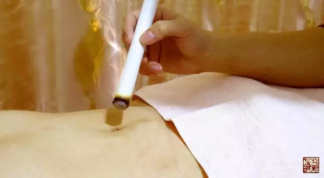

= 关于督脉
王非
2015-3-4 00:00

image::img/03-01.png[]

提到督脉，我首先想到武侠小说里的大侠在经历各种磨难奇遇之后打通自己任、督二脉，然
后就会有各种牛X本领，令人向往不已，这恐怕也是使我很小就着迷中医的原因之一吧。今
天我就和大家来一起试着解开督脉的神秘面纱。当然，还是老规矩，从《黄帝内经》中去寻
找、还原那个最初的“督脉”。

先跟大家汇报一个小心得，在古代由于文字的使用相对不够规范，所以只要读音一样的字都
可以互换使用，叫做“通假字”，但换作是今天那就叫“错别字”。仔细琢磨这些个同音字，
发现他们之间确实存在着某种内在的联系，就比如“经”和“精”。

*“精” ，生殖之精。*几乎所有的生物都要靠它来繁衍、来传递生命。植物要靠花粉来受
精，动物们有的在体外，有的在体内受精，然后这些动植物们才能孕育繁衍出他们的下一代。

*“经” ，经纬之经。*给出人类的思想、智慧、道德、品格，甚至某种专业技能传承的坐
标。像西方现代文明的基石《圣经》，东方文化的母体《易经》、《道德经》，中医的源头
《黄帝内经》等......这些“经”也具有“精”的作用，繁衍、孕育、传递着人类精神文化
的基因，当然也包括中医文明。所以我们的方法论就是追本溯源，回到母体，回到《黄帝内
经》来重新发现中医。

这是师父教给我们的，也是**“立新七针”的最重要的思想武器**。让我们回到《黄帝内经》
看“督脉”，原文共有七篇八处提到“督脉”，归纳起来共讲了三个问题。

== 督脉循行

=== 【起始】

“少腹以下骨中央”：其中的“骨中央”我理解为骨盆的中心点。女性那里有子宫，男性那
里有前列腺。因为从下文看到不论男女督脉都循着外生殖器，沿着纂，然后到达臀部。

=== 【在臀部与足少阴肾经和足太阳膀胱经联络融合】

我们看到肾经的气血方向是由足走头的，也就是说由下到上的，*“贯脊属肾”*，也就是说
沿着脊柱上行，同时连接肾，肾主骨生髓，不论是脑髓，还是脊髓都为肾所生，那么督脉起
到重要的通道作用。

膀胱经的气血方向是从头走足的，也就是从上到下的，督脉与之联络，开始于内眼角，上额
头，到头顶，从头顶入脑，在此处与随肾经上行的督脉部分就会和了。然后继续向下，沿着
颈项，顺着肩甲内侧向下，夹着脊柱，到腰部时再次入肾。这样就形成了**一个循环，一个
回路**。由肾出发，到脊髓，再到脑髓，然后回到肾。肾精化生脊髓、脑髓应该也是个动态
循环的过程，督脉的循行提供了通道。

*小结：督脉起于骨盆中点，然后顺着男女的外生殖器的纂，到达臀部，沿着脊柱上行，同
时络肾，到达脑部。从睛明穴开始下行，上额头，到头顶，入脑与上行部分会和。然后顺着
脊柱两侧下行，最后回到肾。*

=== 【督脉别络】

督脉还有一支别络，是从长强开始，也就是从脊柱的最尾端开始，夹着脊柱上行，然后在顺
着背部膀胱经下来，最后汇入脊柱。
+
由于督脉非常重要，所以一定要有辅助上行的通道，就是此别络。督脉的下行部分与背部膀
胱经重合，背部膀胱经本身就是两条。*所以督脉系统是非常完整的，是双向两车道。*

=== 【督脉是如何参与到十二经循行的】

督脉与肝经在头顶交汇，从这个接口处，督脉连接到十二经的大循环中。

== 督脉与疾病的关系及治疗方法

=== 【督脉病的主要表现】

* 实证就是脊强，甚至反张，脊柱活动不利，受限。
* 虚证就是头重，脊柱无力支撑。

=== 【治法】

“督脉生病治督脉，治在骨上，甚者在脐下营。”

“治在骨上”脊椎骨的形态很特殊，有上、下、左、右、后，七个凸起，向后的是棘突，棘
突之上是棘突上韧带。所以“骨上”是指棘突上韧带。

再严重些或者虚症，就在肚脐下用“**灸法**”治疗。这是繁体字“**營**”，上面是两个
“**火**”，它的本义是市居，就是很多人集中居住的地方。那么在有火的地方安营扎寨，
就是营。所以我认为“**营法**”等同于“**灸法**”。

== 督脉穴位分布规律

**督脉在胸椎的第2、4、8、12棘突下是没有穴位的。**双数为阴，督脉属阳。所以双数的
椎体下没有督脉的穴位。**6是可以拆分成两个3的**，内含阳数。所以第6胸椎棘突下的灵
台穴是个例外。

**督脉在腰椎的3、5棘突下没有穴位。**这是因为腰椎是向腹侧凸的，胸椎是向背侧凸的。
“背为阳腹为阴”所以**胸椎为督脉的阳中之阳，腰椎为督脉的阳中之阴**。

== 【原文】

* 第一篇《灵枢·本枢》
+
缺盆之中，任脉也，名曰天突。一次，任脉之侧动脉足阳明也，名曰人迎；二次脉，手阳明
也，名曰扶突；三次脉，手太阳也，名曰天窗；四次脉，足少阳也，名曰天容；五次脉，手
少阳也，名曰天牖(yǒu，窗户)；六次脉，足太阳也，名曰天柱；七次脉，项中央之脉，督
脉也，名曰风府。腋内动脉手太阴也，名曰天府。腋下三寸手心主也，名曰天池。
+
*【后脑督脉之主穴----风府】。*

* 第二篇《灵枢·经脉》
+
第一处：肝足厥阴之脉，起于大趾丛毛之际，上循足跗上廉，去内踝一寸，上踝八寸，
交出太阴之后，上腘内廉，循股阴，入毛中，过阴器，抵小腹，挟胃，属肝，络胆，上
贯膈，布胁肋，循喉咙之后，上入颃颡，连目系，上出额，与督脉会于巅；其支者，从
目系下颊里，环唇内；其支者，复从肝，别贯膈，上注肺。
+
*【肝经与督脉在巅顶交汇。】*
+
第二处：督脉之别，名曰长强。挟脊上项，散头上，下当肩胛左右，别走太阳，入贯膂。
实则脊强，虚则头重。取之所别也。
+
*【 督脉的别络】*

* 第三篇《灵枢·脉度》
+
督脉、任脉，各四尺五寸，二四合八尺，二五合一尺，合九尺。
+
*【督脉的长短】*

* 第四篇《灵枢·营气》
+
黄帝曰：营气之道，内谷为宝。谷入于胃，乃传之肺，流溢于中，布散于外，精专者，行于
经隧，常营无已，终而复始，是谓天地之纪。故气从太阴出注手阳明，上行注足阳明，下行
至跗上，注大指间，与太阴合；上行抵髀，从脾注心中；循手少阴，出腋中臂，注小指，合
手太阳；上行乘腋，出项内，注目内眦，上巅，下项，合足太阳；循脊，下尻，下行注小指
之端，循足心，注足少阴；上行注肾，从肾注心，外散于胸中；循心主脉，出腋，下臂，出
两筋之间，入掌中，出中指之端，还注小指次指之端，合手少阳；上行注膻中，散于三焦，
从三焦注胆，出胁，注足少阳；下行至跗上，复从跗注大指间，合足厥阴，上行至肝，从肝
上注肺，上循喉咙，入颃颡之窍，究于畜门。其支别者，上额，循巅，下项中，循脊，入骶，
是督脉也；络阴器，上过毛中，入脐中，上循腹里，入缺盆，下注肺中，复出太阴。此营气
之所行也，逆顺之常也。
+
*【督脉是如何参与到十二经循行的】*

* 第五篇《素问·骨空论》
+
督脉为病，脊强反张。督脉者，起于少腹以下骨中央。女子入系廷孔，其孔溺孔之端也。其
络循阴器，合纂（zuǎn）间，绕纂后，别绕臀，至少阴与巨阳中络合，少阴上股内后廉贯
脊属肾。与太阳起于目内眦，上额交巅，上入络脑，还出别下项，循肩髆内。侠脊抵腰中，
入循膂络肾而止。其男子循茎下至纂，与女子等，其少腹直上者，贯脐中央，上贯心，入喉
上颐，环唇上系两目之下。此生病，从少腹上冲心而痛，不得前后，为冲疝，其女子不孕，
癃、遗溺、嗌干；督脉生病治督脉，治在骨上，甚者在脐下营。
+
*【督脉为病、督脉循行、治督脉】*

* 第六篇《素问·气府论》
+
督脉气所发者，二十八穴。项中央二。发际后中八。面中三。大椎以下至尻尾及旁十五穴。
至骶下凡二十一节脊椎法也。
+
*【督脉穴位分布特点。】*

* 第七篇《痿论》
+
帝曰：如夫子言可矣。论言治痿者，独取阳明何也？岐伯曰：阳明者五脏六腑之海，主润宗
筋，宗筋者束骨肉而利机关也。冲脉者，经脉之海也，主渗灌溪谷，与阳明合于宗筋，阴阳
揔（zǒng，总）宗筋之会，合于气街，而阳明为之长，皆属于带脉，而络于督脉。故阳明
虚，则宗筋纵，带脉不引，故足痿不用也。
+
*【督脉与宗筋、阳明经、带脉】*
+
*阳明主润宗筋，冲脉在气街与阳明汇合，但他们都属于带脉，带脉有络于督脉。*
