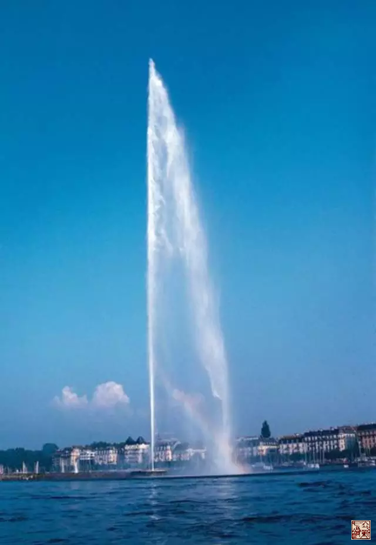

= 关于冲脉
王非
2015-3-18 00:00

== 冲脉起点探源

=== 【结论】

冲脉起于气街（气冲穴）

=== 【理由】

. 《内经》原文中共提到三处起点，分别是：气街两次，关元、胞中各一次。

. 我们应用“咬文嚼字”这一方法去理解冲脉的“冲”字。冲：《说文》涌摇也，从水中。
其本意：向上涌流。也就是说：冲脉是源于气血非常丰富的地方，并且有向上涌动的趋势。

. 那么哪里是气血丰富的地方呢？
+
我们在《素问·血气形志篇》里看到的：“阳明常多气多血，少阴常少血多气。”所以足阳
明经就是气血最丰富的地方，气街就是足阳明胃经的向外涌出的泉眼。
+

== 冲脉的循行

向下：::气街—大腿内侧--—阴谷（斜入腘中）—太溪（下入内踝之后）—从脚背分出—到大脚
趾—渗注诸络。

向上：::
. 循脊柱向上
. 循腹上行，与足阳明胃经并行，布散到胸部，会于咽喉，其分支再到口唇。

【总结】::
* 下肢部位：与足少阴肾经走行一致，但气血走行方向是向下的，与肾经相反。

* 胸腹部位：与足阳明胃经走行一致，但气血走行方向是向上的，与胃经相反。

冲脉是以气街为中心点，分别向上下走行，到足灌注阴经及诸络，到咽喉灌注诸阳经。

== 冲脉的作用

. 冲脉是十二经之海、五脏六腑之海，经络之海、血海。
. 冲脉与阳明合于宗筋
. 温肌肉

== 冲脉在“立新七针”中的临床应用

. *“喷涌吧”----冲脉。*
+
“立新七针”本身的思想就是活灵活现的真实具体的体现了《内经》的气血理论，而冲脉贵
为“经脉之海”，更是其重点。
+
在气街的部位用“立新七针之员针”效果妙不可言，就像把那个泉眼扩大了一样，使冲脉痛
痛快快的、充分的涌摇而出，去灌注十二经脉。
+

. *“天枢”----冲脉之枢*
+
体验过“立新七针”的人大都知道“天枢”的微妙之处，“气在腹者，止之于背腧，与冲脉
于脐左右之动脉者”，天枢是腹部气机的枢纽，也是冲脉在腹部的重要穴位，“立新七针”
在调理周身的气血运行时，常常事半功倍，往往只扎一两针，两三针就能立愈沉疴，就是在
于他抓住了气血运行的关键节点，“立新七针之员利针”调节天枢其妙难言。
