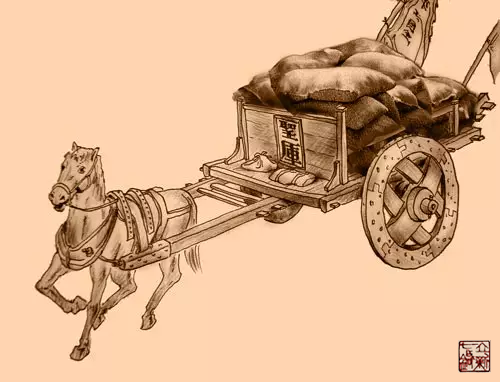
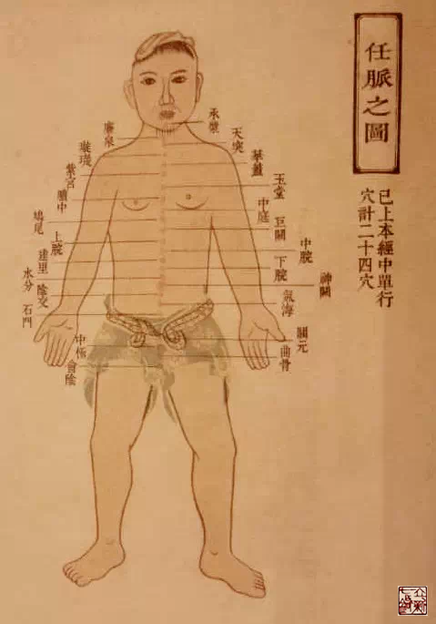

= 关于任脉
王非
2015-4-2 00:00

image::img/王非.png[]

== 任的本义就是担担子

如果说督脉是督军，是统帅，那么任脉就是执行官，是粮草官，为督脉提供着物质支持。
“督脉生病治督脉，治在骨上，甚者在脐下营”，从这句中，看到脐就是以任脉为主的区域，
为督脉提供着气血的支持。

== 任与妊

就整个人类繁衍而言,女性的负担比男人更重，男人只需要几秒钟就可以完成精子的导入，
而女性的卵子一旦受精，妊娠过程就需要十个月的时间，一朝分娩时也是会流失大量气血津
液。所以任脉对女性而言更为重要。

同时，任脉在维持女性的第二性征中起着重要作用：

* 月经的产生与消失：
** 天癸成熟，任脉通----月经按时来
** 天癸竭，任脉不通----绝经
* 女人不长胡子是为什么？
+
因为女性每月丢失血分，不能荣养口唇，故而不长胡须。

== 任脉的走行

起于会阴，上行至毛际，再循腹部的中线上行通过关元，直到咽喉，再上颐，循面，最后进
入目的承泣穴。

== 任脉的别络

任脉的别出络脉，名叫尾翳(本义为羽毛做的华盖)，鸠尾穴的别称：由此别出下行，散于腹
部。如果本络脉发生病变，属实的是腹皮痛，属虚的是谷道搔痒。治疗这些病证，可取本经
别出络穴尾翳。
