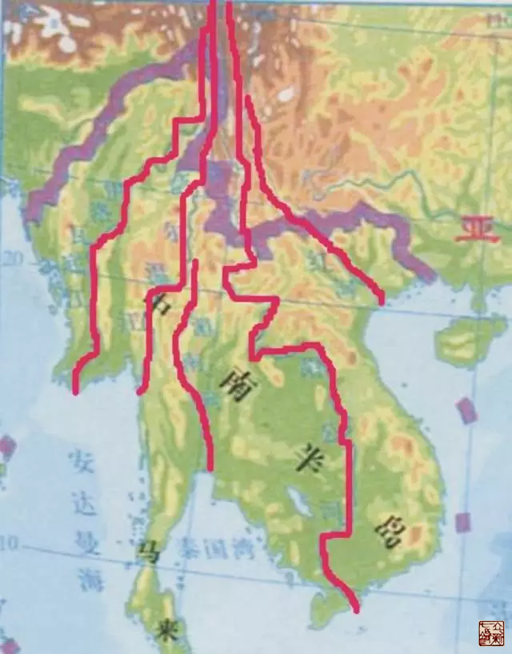
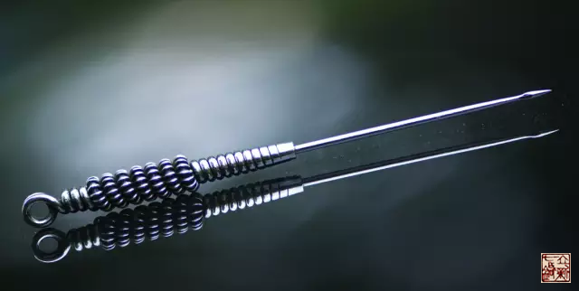

= 人体的山脉 —— 经筋
王非
2015-4-15 00:00

image::img/王非.png[]

如果说经脉是人体的河流，那么经筋就是人体的山脉。从地图上看，他们走行大致一样，但
是山脉的形成是地壳板块运动的结果，人的经筋系统也是人体四肢关节运动的主要负责人。

在有等高线的地形图上，河流的流向与等高线的凸出方向相反。一般来说，山脉大致怎么走
向（从高到低），河流就怎么走向。可以看看中南半岛的地形图。

附图：中南半岛的地形图

== 什么是筋痹？

“风寒湿三气杂至，合而为痹也，以春遇此者为筋痹”《素问·痹论》

痹者，闭也。当卫阳之气在此处闭塞不通，失于温养，风寒湿邪乘虚而入成为此症。多发于
春季，从二月立春开始，阳气萌动，有些植物开始破土发芽，人的皮肤腠理也慢慢开启，但
此时阳气初动尚未充盈于体表，风寒湿邪易于侵袭形成筋痹。

== 筋痹的病机

生态环境好的山脉是有丰富的植被覆盖的，物种丰富，生机勃勃，还可以涵养水源，调节水
量分布。当山脉生态环境遭到破坏，植被消失，水土流失，裸露的山石会被风化、被雨水冲
刷形成泥石流，成为沙尘暴的源头，总之病了的山脉会有缩减。

人体的经筋病了也是如此，经筋会变短缩，挛缩。

所以说筋痹的核心病机就是：“*筋缩*”。

筋被缩短了，就会导致两个问题：

. “病在筋，筋挛诸节痛，不可以行，名曰筋痹”《素问·长刺结论》
+
气血不通畅，不通则痛。

. 筋缩短会导致关节活动障碍。以“屈不能伸”为主要表现。
+
“刺犊鼻者，屈不能伸”《灵枢·本输》
+
“手屈而不伸者，其病在筋”《灵枢·始终》

分析:关节的活动是由筋与肌肉弛张来完成其屈伸旋转的。四肢关节之所以能够屈伸自由，
凭借就是筋的柔软、能伸能缩、能长能短。当筋“缩”了，关节尤其在**伸**的时候短缩的
**筋**会被牵扯、拉伸，由此会产生疼痛、关节活动受限。筋缩所产生的症状就会表现的更
明显。

== 筋痹的特点

其轻症特点：*病位局限、病情轻浅、不易传变*。（源于《痹症的奥秘—经筋与卫气》）

但需特别注意：::

重症经筋痹也会顺其走行上下蔓延，例如腰骶部的筋缩也会影响到下肢甚或向上蔓延影响到
胸椎、颈椎。
+
不易传变，但是也会传变。“筋痹不已，复感于邪，内舍于肝”《素问·痹论》

== “在筋”如何“守筋”？

刺筋上、恢刺、关刺

【原文】::

“刺筋上为故，刺分肉间，不可中骨也”《素问·长刺结论》
+
“恢刺者，直刺傍之，举之前后，恢筋急，以治筋痹也”《灵枢·官针》（恢:《说文》大也。
傍:《说文》近也）“关刺，关刺者，直刺左右尽筋上，以取筋痹，慎无出血，此肝之应
也”《灵枢·官针》

“恢刺、关刺” 我理解为在筋急的地方下针，贴近找准拘急的筋，前后沿着筋的走行方向刺。

“痹者，闭也。”当我们用师父冰台先生所发现并创制出的员利针，治疗筋痹时，真可谓效如桴鼓。牛尾形的针尖，正好挤出一个空间，使得卫阳之气得以穿行，专门克制痹症之闭。卫气得行，筋得以濡养，短缩之筋得以扩张，拉伸，诸症俱消。

感恩师父，惊为天人！
