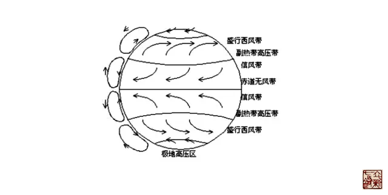

= 带脉——人体的赤道
王非
2015-4-29 00:00

如果说经络是人体的河流，那么这条河应该是活的，在其流动的过程中是不断与自然环境相
交换的，除了河水会不断的蒸发到空气中，流域里的雨水又会不断补充河水，同时河水还会
不断滋养流域里的植被涵养住雨水。记得我师冰台立新先生给我们做过这样一个比喻，一条
河流，把它的河床全部水泥化、做好防水，并加上盖子防止它的渗漏和蒸发，这样一条河其
实是死的，没有了与自然界的交换和循环，很快就会干涸。

如此来说，雨水对河流的影响是很大的，师父位于重庆的研究所不远处就有一条河直接连接
到长江，记得我们到师父那儿的时候是六月，河水的水面距离岸边有四、五米的垂直距离，
师父说有一年雨水大，这条河暴涨，把离河不远的诊所都淹了。

雨水对河水的水位有如此大的影响，那我们就要思考雨水是怎么形成的，地球的水循环在以
前跟大家讲过，主要就是大海、大湖、大河蒸发的水汽，上升，随着气流到了陆地，遇到冷
的气流就会凝结成雨降落下来。在这里，请大家注意**饱含水汽的空气**，它的运动轨迹是
受到了地球**大气环流**的影响，规律性的把水带到了相应的地带。实现了对地球上的河流
的水量分布。

道法自然，地球的大气环流，带着水汽，调控着地球上的河流。对地面的河流也起着分类、
组合和主导作用，但是大气环流并没有和地表的河流有直接络属关系。*从这个层面讲奇经
八脉就是体内的大气环流，因为奇经八脉也有着类似的功能特点。*

*我们看奇经八脉的生理特点有三：*

. 密切十二经脈间的联系，但没有直接的络属关系。
. 对十二经脈起着分类、组合和主导的作用。
. 对经络气血起着渗灌和蓄溢的调节作用。

*下面我们就从这个角度来看看带脉：*

《内经》中直接提到带脉的只有三处，其中明确提出属于带脉的具体部位是腰部的十四椎，
大约是命门穴的位置，又讲到阳明经、冲脉、宗筋他们都汇聚到气街，在人体的部位当是在
小腹部，也属于带脉的范畴。这样前后结合起来看，带脉的走行就是围着人体后腰到小腹的
这一圈。

* 这个圈有什么特殊性？
* 他为什么就能约束诸经？
* 这个圈，圈住了什么？

这个圈的里面就是丹田、就是命门火、是人体的生命原动力，是人体内太阳的所在。如此说
来，从天人相应的角度，*带脉就是人体的赤道*。

从大气环流的知识中我们知道，在地球赤道的两侧各有一种非常固定的封闭的环流，由温暖
潮湿空气从**赤道低压**地区上升开始，升至**对流层顶**，向极地方向迈进。直到南北纬
30度左右，这些空气在**高压**地区下沉。部分空气返回地面后于**地面**向赤道返回，形
成信风，完成低纬度环流。

见图：

从图中我们看到低纬环流也叫信风带，在赤道两侧是反方向的，*我们人体的隶属于带脉的冲
脉也是从气街冲出来后一支向上，一支向下，反方向的*。这是自然的巧合，还是道法自然的
真理？这就是我理解的带脉。
