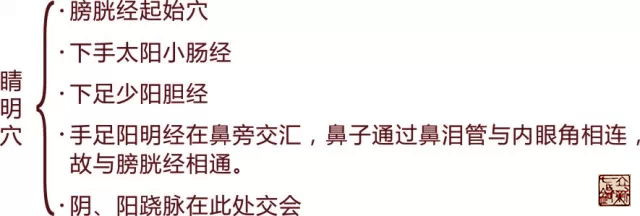

= 阴跷脉阳跷脉——卫气出入的桥梁
王非
2015-5-13 00:00

image::img/王非.png[]

== 睛明穴——卫阳之气升起的地方。

“是故平旦阴气尽，*阳气出于目*，目张则气上行于头，循项下足太阳，循背下至小趾之端。
*其散者，别于目锐眦*，下手太阳，下至手小指之间外侧。*其散者，别于目锐眦*，下足少
阳，注小趾次趾之间。以上循手少阳之分侧，下至小指之间。别者以上至耳前，合于颔脉，
注足阳明以下行，至跗上，入五趾之间。其散者，从耳下下手阳明，入大指之间，入掌
中。”《灵枢·卫气行》

我们看到伴随着日出，卫阳之气从阴出阳的主要出口就是**睛明穴（内眼角）**。

由此可以更深刻理解**师父的刺攒竹为何功效强大**。希望同门们重视。

== 阳跷脉——卫气从阴到阳的桥梁

白天日出，卫气从足太阳膀胱经开始（始出于睛明穴）通过膀胱经分行于诸阳经，阳跷脉渐
盛，目张而醒。

=== 【循行】

*阳跷脉为足太阳膀胱经之别*，起于申脉穴，沿腿部膀胱经逆行，到大腿及臀部外侧，到肩
胛外侧，经巨骨到人迎、地仓、最后到内眼角，五脉会于睛明穴。

== 阴跷脉——卫气从阳到阴的桥梁

=== 【卫气从阳入阴】

“......阳尽于阴，阴受气矣。其始入于阴，常从足少阴注于肾，肾注于心，心注于肺，肺
注于肝，肝注于脾，脾复注于肾为周。”《灵枢·卫气行》

*卫气由表返内的主要通道是肾与足少阴肾经，阴跷脉为足少阳肾经之别，故阴跷脉是主要
桥梁。*

=== 【循行】

阴跷者足少阴之别脉，其脉起于跟中足少阴然谷穴之后，同足少阴循内踝下照海穴，上内踝
上二寸，以交信为郄，直上循阴股，入阴，上循胸，入缺盆，上出人迎之前，至喉咙，交贯
冲脉，入鼽内廉，上行属目内眦，与手足太阳、足阳明、阳跷五脉会于睛明而上行。《奇经
八脉考》

*其中脾胃是卫气周而复始的关键所在，所以有“胃不和，则卧不安”之说，是因为脾胃问
题影响了卫气的运行，卫气的正常运行是维持正常睡眠的基础。*

== 睡眠、下肢内外肌力平衡——是阴跷脉阳跷脉的两大功能

=== 睡眠

卫气循行正常，人的睡眠功能就正常。卫气循行，阴、阳跷脉是主要桥梁。

“帝曰：病而不得卧者，何气使然？岐伯曰：卫气不得入于阴，常留于阳。留于阳则阳气满，
阳气满则阳跷盛，不得入于阴则阴气虚，故目不瞑矣。

黄帝曰：目闭不得视者，何气使然？岐伯曰：卫气行于阴，不得入于阳，行于阴则阴气盛，
阴气盛则阴跷满，不得入于阳则阳气虚，故目闭也。”《灵枢·大惑论》

“......入脑乃别阴跷、阳跷，阴阳相交，阳入阴，阴出阳，交于目锐眦，阳气盛则瞋目，
阴气盛则瞑目。”《灵枢·寒热病》

*阳跷脉盛，目张而醒；阴跷脉渐盛，目合而睡。*

=== 下肢内外肌力的平衡

跷：举足高行也。《说文》

跷有足跟和跷捷的含义，因跷脉从下肢内、外侧上行头面，具有交通一身阴阳之气，调节肢
体运动的功用，故能使下肢灵活跷捷。跷脉气失调，还会出现肢体外侧肌肉弛缓而内侧肌肉
拘急，与运动功能有关。

《难经·二十九经》：“*阴跷为病，阳缓而阴急；阳跷为病，阴急而阳缓。*”此症多见于
偏瘫的病人，当下肢肌肉肌力及肌张力减弱，内侧肌张力增高，拘急，此为阴跷病，反之就
是阳跷病。
