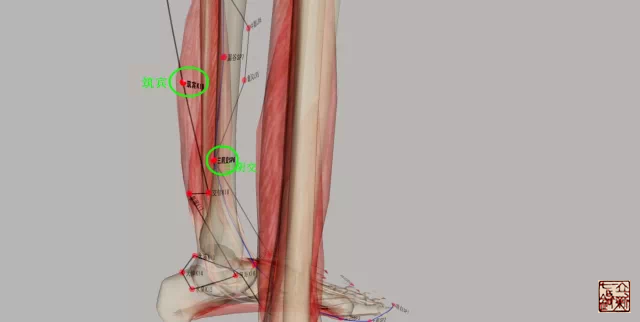
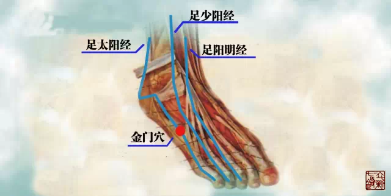
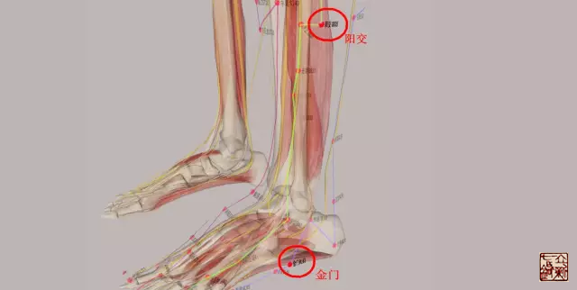
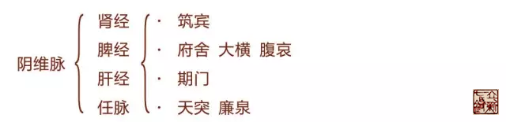
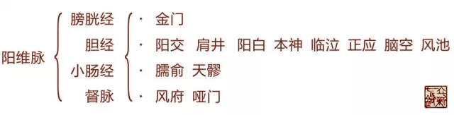
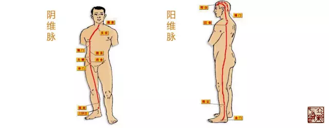

= 提纲挈领十二经之阴维脉阳维脉
王非
2015-5-27 00:00

include::王非.adoc[]

“维”的本意是系物的大绳。如：维纲（用以系物和提网的绳。亦指维系、保持）。如果把
十二经络、经筋、别络、孙络、浮络，整体看成一阴、一阳两张网，那么阴维脉、阳维脉就
是这提起两张网的两条大绳。

这两条大绳有如下的特点：

. 起点：分别起于足三阴交和足三阳交。
+
阴维脉起于诸阴之会，在足踝部就有三阴交穴，所以我认为阴维脉起于三阴交穴部位，但是
从筑宾穴发于体表。
+

+
阳维脉起于诸阳之会，《内经》告诉我们诸阳之会在头面，那么此处的诸阳之会当如何理解？
请参看下图，从图中我们看到足三阳的踝部筋确实交会在金门穴。金门穴也是阳维脉的起点，
再从金门穴行於足少阳胆经之外踝上七寸阳交穴。
+

+

. 循行过程中网络诸经  
+

+
注意：足阳明是行走在人体腹部，腹部是属阴的。所以阴维脉会足太阴、厥阴、少阴、阳明
于腑舍《奇经八脉考》
+

== 《奇经八脉考》之【循行】

* 阴维脉：阴维起于诸阴之交，其脉发于足少阴筑宾穴，为阴维之 ，在内踝上五寸肉分中。
上循股内廉，上行入小腹，会足太阴、厥阴、少阴、阳明于腑舍。上会足太阴于大横、腹哀。
循胁肋会足厥阴于期门。上胸膈挟咽，与任脉会于天突、廉泉，上至顶前而终。凡一十四穴。

* 阳维脉：起於诸阳之会，即起於足太阳膀胱经之足外踝下一寸金门穴。再从金门穴行於足
少阳胆经之外踝上七寸阳交穴。又与手太阳小肠经、足太阳膀胱经及阳跷脉，会於肩後大骨
下胛上廉臑俞穴，又与手少阳三焦经、足少阳胆经，会於缺盆中上毖际天穴，又会於肩上陷
中肩井穴。从肩井穴上头，与足少阳胆经会於眉上一寸阳白穴。从阳白穴上行於眼上方，直
入发际本神、临泣穴。从临泣穴上行经正营穴，循行枕骨下而至脑空穴。从脑空穴下行至耳
後大筋外端风池穴，又与督脉会於项後风府、哑门穴。

== 《素问•刺腰痛论》有关阴、阳维脉二则

. “飞阳之脉令人腰痛，痛上怫怫然，甚则悲以恐。刺飞阳之脉，在内踝上五寸，少阴之前，
与阴维会。”
+
飞阳=飞扬，足太阳之别，名曰飞扬，去踝七寸，别走少阴。此处是足太阳膀胱经分出络足
少阴肾经之所。
+
病发生于飞扬脉，所引起的腰痛的特点同阳维脉相同都会有心理的问题，就是痛起来心里就
感到不安，甚至于会发生悲哀和恐惧现象。我们都知道肾主恐。阴维脉就是起于肾经筑宾穴。
所以这时患者的心里有很强的不安和恐惧感，我们就能很好的理解。
+
治疗时，就在阴维脉的起始位置，筑宾穴。内蓄手足三阴之气血，内在势能非常强大，一旦
开闸，其下游堵塞处必被强大的气血如将摧枯拉朽般铲除。
+
筑宾穴：位于小腿内侧，当太溪穴与阴谷穴的连线上，太溪穴上5寸，腓肠肌肌腹的内下方。

. “阳维之脉令人腰痛，痛上怫然脉肿。刺阳维之脉，脉与太阳合腨下间，去地一尺所。”
+

+
怫：愤怒、抑郁心情不舒畅。
+
痛上怫然脉肿：这种痛令人情绪相当不好，或是愤怒，或是抑郁不畅。我们看到阳维脉的循
行与肝胆经的交会更多一些，肝主疏泄，如果疏泄太过或不畅的话很容是出现急躁易怒或是
抑郁寡欢。
+
同时这种痛还伴随有肿胀之感，按照气血江河理论，瘀阻处当在下游。
+
治疗部位就在阳维脉的源头，阳交穴。暗合师父的开闸放水理论，从源头论治，此处内蓄手
足三阳之气血，一旦开闸水势如万马奔腾，不可阻挡，什么陈淤泥沙一概被冲的无影无踪。
+
阳交穴：位于人体的小腿外侧，当外踝尖上7寸，腓骨后缘。

