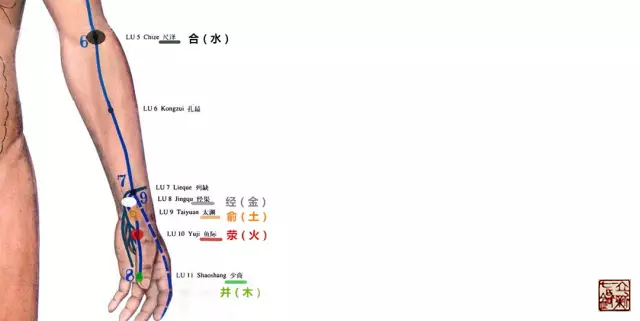
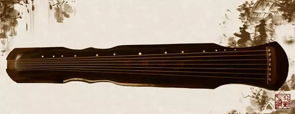
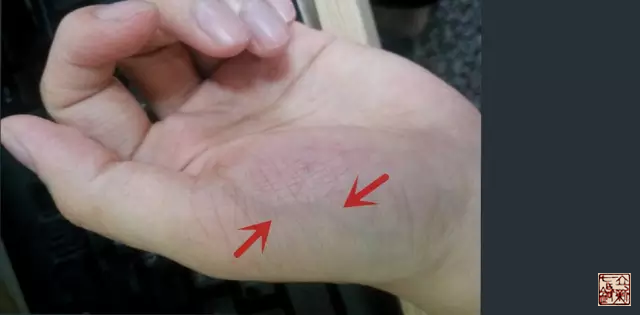

= 五输穴分论——手太阴肺
王非
2015-6-24 00:00

image::img/王非.png[]

【手太阴肺】::

肺出于少商，少商者，手大指端内侧也，为**井木**；溜于鱼际，鱼际者，手鱼也，为**荥
**；注于太渊，太渊鱼后一寸陷者中也，为**俞**；行于经渠，经渠寸口中也，动而不居为
**经**；入于尺泽，尺泽肘中之动脉也，为**合**。
+
手太阴经也。《灵枢·本腧》
+

== 定位

师父教导我们“穴位”并非是教科书上的死教条，更不是经络人或者经络图上的那个点。穴
位应当是活的，需要我们针者实地考察，才能确定的一个范围。现在我们来看手太阴肺的这
五个穴。

少商:: 手大指爪甲上与肉交者。

鱼际:: 手掌一侧为白肉，手背一侧为赤肉，赤肉与白肉之间的边际为鱼际，实则贴着第一
掌骨的前缘中点。

太渊:: 在鱼际后一寸，凹陷之中。当我们手腕做屈伸时，把指头放在腕横纹桡侧端处可以
感觉到凹陷。此穴当在此处。

经渠:: 在寸口中，不停的跳动并不固定，当桡动脉在寸口处搏动最明显的地方。并且气血
从经渠这个地方就潜入于里了。

尺泽:: 就是在肘中的动脉。

== 《内经》中所提及的功效

=== 【少商】

==== 释名

五音配五行为：宫—土，商—金，角—木，徴—火，羽—水。

肺也属金。而少商又为古琴之第七弦。

从《灵枢·阴阳二十五人》中我们又看到有上商、右商、左商、及少商。因此“商”代表肺
金。“少”代表次序，而且是代表最后，最末的意思。少商穴就是表达此穴是肺经的最后一
个穴。

“金形之人比于上商，似于白帝，其为人方面白色、小头、小肩背小腹、小手足如骨发踵外，
骨轻。身清廉，急心静悍，善为吏，能秋冬，不能春夏，春夏感而病生。手太阴敦敦然，釱
商之人比于左手阳明，阳明之上，廉廉然。右商之人，比于左手阳明，阳明之下脱脱(tuì)
然。左商之人比于右手阳明，阳明之上监监然。少商之人，比于右手阳明，阳明之下，严严
然。”《灵枢·阴阳二十五人》

==== 功效

“黄帝曰：人之耳中鸣者，何气使然？岐伯曰：耳者，宗脉之所聚也，故胃中空则宗脉虚，
虚则下，溜脉有所竭者，故耳鸣，补客主人，取手大指爪甲上与肉交者也。”《灵枢·口问》

在这一段是讲人为什么会耳鸣？是因为耳是宗脉的汇聚之处，当气虚时，气下陷，营气则不
能上济，宗脉失于濡养就会耳鸣。

怎么办呢？要补客主人。

为什么要补客主人呢？这里的客主人是指耳前的动脉，其搏动的强弱代表着宗脉气血的强弱。
客主人是个窗口，耳部宗脉气血强弱的窗口。

怎么补呢？取手大指爪甲上与肉交者也。此处就是少商穴。

为什么取少商穴呢？

我想有两个理由：其一，肺主气，少商穴作为肺经的穴有补气振奋宗脉的作用。其二少商穴
是属木的井穴，客主人也是属木的，属于胆经的。

=== 【鱼际】

. 鱼际白肉有青血脉者，胃中有寒。《灵枢·论疾诊尺》
+

. “厥心痛，卧若徒居，心痛间，动作，痛益甚，色不变，肺心痛也，取之鱼际、太渊。”
《灵枢·厥病》“徒居”：无业闲居。“作”：人突然站起。
+
这种“肺心痛”平时闲躺着就会发病，当活动或者突然站立时，心肌需氧量增加此时症状加
重，这极为类似现代医学所讲的不稳定性心绞痛。应属心气不足所引起。肺主气，司呼吸，
整体病机为心肺气虚。取穴是鱼际、太渊。说明此二穴有补气，增强心肺功能的作用。

. “热病，而汗自出，及脉顺可汗者，取之鱼际、太渊、大都、太白。泻之则热去，补之则
汗出，汗出大甚，取踝上横纹以止之。”《灵枢·热病》
+
肺主皮毛，鱼际、太渊有解表发汗祛热邪的作用。

. “黄帝曰：何为逆而乱，岐伯曰：清气在阴，浊气在阳，营气顺脉，卫气逆行，清浊相干，
乱于胸中，是谓大悗。···乱于肺，则俛仰喘喝，接手以呼····。
+
黄帝曰：五乱者，刺之有道乎？岐伯曰：有道以来，有道以去，审知其道，是谓身宝。黄帝
曰：善。愿闻其道。岐伯曰：···气在于肺者，取之手太阴荥···”《灵枢·五乱》“悗”：
烦闷。“俛”：俯的异体字，屈身，低头。
+
当出现营气卫气互相逆乱，并且这种逆乱发生在肺时，表现为呼吸困难，张口抬肩，前俯后
仰。这时也可以用鱼际，使营气、卫气有道以来，有道以去，各行其道，平顺气机。

=== 【太渊】

阳中之少阴，肺也，其原出于太渊，太渊二。《灵枢·九针十二原》

肺的原穴：太渊。

其余的作用同鱼际的2、3条。

=== 【经渠】

《咳论》中，肺经咳嗽，伴有浮肿者，取经渠。

=== 【尺泽】

此处有动脉，《素问·刺禁论》中提到若深刺会导致前臂不能屈伸。《素问·至真要大论》中
提到若是此处动脉搏动消失，肺气败亡，人死不治。
