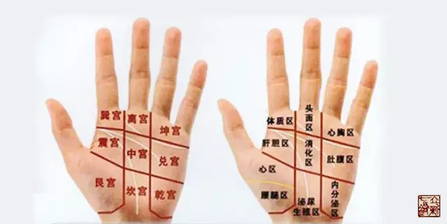

= 心的五输穴
王非
2015-7-8 00:00

include::王非.adoc[]

按照《灵枢·本输》的顺序，肺的五输穴讲完了，接下来就是心的五输穴，但是心包代心受
邪，所以原文中出现“心出于中冲”，由此可知心包经与心的最重要的生理功能关系更为密
切。

* 心出于中冲，中冲，手中指之端也，为井木；
* 流于劳宫，劳宫掌中中指本节之内间也，为荥；
* 注于大陵，大陵掌后两骨之间方下者也，为俞；
* 行于间使，间使者两筋之间，三寸之中也，有过则至，无过则止，为经；
* 入于曲泽，曲泽，肘内廉下陷者之中也，屈而得之，为合。手少阴经也。

== 【中冲】
=== 位置

中指之端。指爪甲上与肉交者。在指端应该尽量靠近指甲。

=== 功效

耳聋、耳鸣。

“邪客于手阳明之络，令人耳聋，时不闻。刺手大指次指爪甲上去端如韭叶各一痏，立闻。
不已，刺中指爪甲上与肉交者，立闻。其不时闻者，不可刺也。耳中生风者，亦刺之如此数，
左刺右，右刺左。”《素问·缪刺论》

释义：邪气侵犯到手阳明经的络脉，会导致人耳聋，阵发性的听不到。先刺少商、商阳，马
上就听见了。不好，刺中冲，马上听到。如果不是阵发性的耳聋，不可以如此治疗。耳鸣如
风吹这种情况也可以如此治疗，左刺右，右刺左。

分析：这种阵发性的耳聋，应该属于是急症。邪在手阳明之络，所以先刺太阴之井少商、阳
明之井穴商阳。如果没好，再刺心的井穴，中冲。

== 【劳宫】

=== 位置

掌中中指本节之内间也。中指本节掌骨是第三掌骨。所以此穴当在第二掌骨与第三掌骨之间。

=== 功效

《内经》原文只此一处记载。后世文献记载发挥不多。此处提出一点，就是手掌的八卦九宫
图之中，劳宫正好落在了中央。

=== 【大陵】

=== 位置

掌后两骨之间方下者也。掌后两骨为尺骨、桡骨无疑。在他们之间联合的前面缝隙处。(方：
本义为并行的两船;泛指并列;并行。

=== 功效

. 阳中之太阳，心也，其原出于大陵，大陵二。《灵枢·九针十二原》心的原穴。主治心本
脏之疾病
. “黄帝曰：五乱者，刺之有道乎？岐伯曰：有道以来，有道以去，审知其道，是谓身宝。
黄帝曰：善。愿闻其道。岐伯曰：气在于心者，取之手少阴，心主之俞；...。”“气乱于
心，则烦心密嘿，俛首静伏。”《灵枢·五乱》
+
本篇论述了“气乱于心，乱于肺，乱于肠胃，乱于臂胫，乱于头”之五种乱证，指出它的病
因，是由于清气在阴，浊气在阳，营气顺脉，卫气逆行，清浊相干卫气逆行，升降失调所致。
+
心乱的表现：心中烦闷，沉默不语，低着头静伏。嘿同默。
+
心乱的治疗取穴是:
+
* 手少阴心经的俞穴：神门。
* 手厥阴心包的俞穴：大陵。

== 【间使】

=== 位置

两筋之间，三寸之中也，有过则至，无过则止。

当心有病，有问题的时候，此处就会有反应，有表现。这里我认为主要是指瘀络。没问题，
就没有表现。

=== 功效

治疗心咳。

“...心咳不已则小肠受之，小肠咳状，咳而失气，气者与咳俱出。...

帝曰：治之奈何？岐伯曰：治脏者治其俞，治腑者治其合，浮肿者治其经。帝曰：善。”《素问·咳论》

心咳，咳嗽的同时放屁。治疗时以间使为主穴。

== 【曲泽】

=== 位置

肘内廉下陷者之中也，屈而得之。注意取此穴时要屈肘，同时手掌及前臂应该处于功能位。
肘中内侧凹陷处。

=== 功效

“···刺肘中内陷气归之，为之不屈伸。···”《素问·刺禁论》

此穴同尺泽一样，深刺、大刺激量时会使气归于此，聚而不散，出现前臂不可屈伸的表现。
