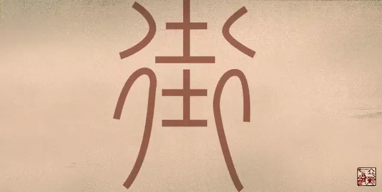
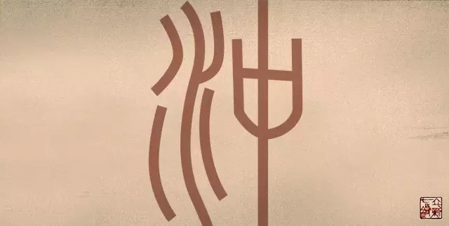

= 气街与气冲
王非
2015-9-9 00:00

include::王非.adoc[]

什么是气街？要想知道什么是气街，首先要知道什么是“街”。

“街”字的小篆体像纵横相交的十字路。“街,四通道也。”《说文》

“街”的本义就是:四路相通的大道。有点像我们今天的十字路口。

== 【气街】

广义的定义::

用援物比类的思想看“气街”，就应当是人体中气运行的十字路口。        

狭义的定义::

就是特指人体中气运行的最大的十字路口。

人体最大的横向经络就是带脉，人体气血最多的纵向经络就是足阳明胃经，以及冲脉。他们
的交汇就构成人体中最大的十字路口。就是狭义的“气街”。

所以我认为狭义的“气街”就是：髂前上棘到同侧耻骨结节的这一区域，左右对称。也就是
我们的腹股沟区域。

实际应用：生活中的十字路口，最容易发生交通事故，还要有红绿灯来控制交通。人体中气
的运行也容易在十字路口产生紊乱。

《内经》共十篇十三处提到“气街” 。狭义的占九篇，广义的一篇。

== 气冲与气街的区别

冲，涌摇也，从水中。《说文》

我们看到“冲”字的小篆体表达的意思是从水中喷涌动摇的意思。人体中涌摇之处一定就是
动脉搏动之处，结合内经原文，我们知道“气冲”当为腹股沟内股动脉的搏动处。

狭义的气街与气冲的区别::

我认为狭义的气街是指腹股沟整个区域。而气冲仅为腹股沟内股动脉搏动处，所指范围更小
更具体一些。
