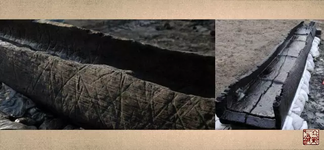

= 缪刺
王非
2015-9-23 00:00

include::王非.adoc[]

什么是缪刺？要想搞清楚什么是缪刺，首先要知道邪气侵犯人体的常规路径：

如此常规的传变，就按照正常的经络循行，按冰台师父经典的“上下游理论”治疗就可以了。

那么不按照常理出牌的病，就叫奇病。

* 奇病的特点：
. 不能够入于经。
. 其邪停留在络，又不能够入经，就会上下左右的乱穿。从左跑到右，从右跑到左，从上跑
到下，从下跑到上。
* 奇病的治疗：
+
不管在络的邪气怎么乱跑，都跑不出肘、膝关节以下，也就是五输穴的范畴，因为到了合穴
就要入经了，奇病之邪入不了经，所以治疗奇病不用循经，不用背俞穴。只是在上下左右的
五输穴处做文章就可以了。

.【原文】
[quote, 《素问·缪刺论篇》]
____
“黄帝问曰：余闻缪刺，未得其意，何谓缪刺？岐伯对曰：夫邪之客于形也，必先舍于皮毛，
留而不去，入舍于孙脉，留而不去，入舍于络脉，留而不去，入舍于经脉，内连五脏，散于
肠胃，阴阳俱盛，阴阳俱感，五脏乃伤，此邪之从皮毛而入，极于五脏之次也。如此则治其
经焉。

今邪客于皮毛，入舍于孙络，留而不去，闭塞不通，不得入于经，流溢于大络，而生奇病也。

夫邪客大络者，左注右，右注左，上下左右与经相干，而布于四末，其气无常处，不入于经
俞，命曰缪刺。”
____

*我们看当邪气常规传遍时在各个部位的表现是什么：*

* 邪在皮肤：浑身冷，毛发立；
* 邪在络脉：肌肉痛；
* 邪在经脉：寒颤，容易受到惊吓；
* 邪在背俞：六经不通四肢，*（此处当是卫气的主要通道被堵塞，不能布达四肢。可见背
部的督脉和背俞穴是卫气最主要的通道。）*肢节痛，腰脊强。

[quote,《说文》]
俞,空中木为舟也。

段玉裁注：空中木者,舟之始。人体中的舟应该就是脊柱区域。

据媒体报道，考古学家在加拿大彼得伯勒地区充满淤泥的河道中挖掘发现8艘青铜器时代木
舟，发现的木舟最大长度为8.5米，3500年前用于沼泽摆渡运输货物和乘客。

邪在伏冲之脉::

体重身痛，留而不去。
+
伏冲之脉，指冲脉之伏行于脊内者。《灵枢·岁露论》：“入脊内，注于伏冲之脉。”

邪在肠胃::

贲响腹胀，肠鸣腹胀。
+
賁 bēn：今名膈膜或横隔膈膜,膈的古称。如:贲门，指胃上端的开口。
+
多寒则肠鸣飧泄，食不化；多热则溏出糜。

邪在募原之间::

成积。（形成有形的包块）可以显现在不同的地方。或著孙脉，或著络脉，或著经脉，或著
俞输脉，或著于伏冲之脉，或著于膂筋，或著于肠胃之募原，上连于缓筋，邪气淫泆，不可
胜论。
+
（*著*：显现；显扬。*膂*：脊梁骨）

.【原文】
[quote,《灵枢·百病始生》]
“是故虚邪之中人也，始于皮肤，皮肤缓则腠理开，开则邪从毛发入，入则抵深，深则毛发
立，毛发立则淅然，故皮肤痛。留而不去，则传舍于络脉，在络之时，痛于肌肉，其痛之时
息，大经乃代。留而不去，传舍于经，在经之时，洒淅喜惊。留而不去，传舍于输，在输之
时，六经不通，四肢则肢节痛，腰脊乃强。留而不去，传舍于伏冲之脉，在伏冲之时，体重
身痛。留而不去，传舍于肠胃，在肠胃之时，贲响腹胀，多寒则肠鸣飧泄，食不化，多热则
溏出糜。留而不去，传舍于肠胃之外，募原之间，留著于脉，稽留而不去，息而成积，或著
孙脉，或著络脉，或著经脉，或著输脉，或著于伏冲之脉，或著于膂筋，或著于肠胃之募原，
上连于缓筋，邪气淫泆，不可胜论。”
