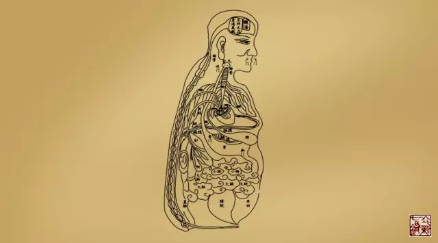

= 髓海之气街
王非
2015-10-20 00:00

include::王非.adoc[]

[quote,《灵枢·海论》]
____
脑为髓之海，其输上在于其盖，下在风府。

髓海有余，则轻劲多力，自过其度；髓海不足，则脑转耳鸣，胫痠眩冒，目无所见，懈怠安
卧。
____

髓海为四海之一，是卫阳之会，又通督脉、阳维，此处的气街就是有多条经络汇聚的地方，
都是非常重要。临证时都要仔细巡查。

== 【耳上角】

=== 经络

* 膀胱足太阳之脉：其支者，从巅至耳上角。
* 三焦手少阳之脉：其支者，从膻中上出缺盆，上项系耳后，直上出耳上角，以屈下额至䪼。

=== 定位

耳上角就是耳尖直对的头皮处。

我们通过揣摸发现绝大多数人都可以在此处摸到条筋结，且往往左右两边感觉不对称。

=== 临床

外感时往往由此牵扯一侧头痛。

部分颈椎病，病以三焦经为主的此处多有阳性表现。

== 【巅】（巅为头顶）

* 膀胱经在此有分支；
* 肝经与督脉交汇于此；
* 督脉上额交巅；
* 三焦经的经别络于此；
* 胆的经筋交于此；
* 营气的运行也上巅、交巅；

总之，巅顶所汇聚的经络范围极为广泛，临症时不可不查。

【原文】

* 手少阳之正，指天，别于巅。《灵枢·经别》
* 足少阳之筋……上额角，交巅上《灵枢·经筋》
* 膀胱足太阳之脉，起于目内眦，上额，交巅；其支者，从巅至耳上角。
* 肝足厥阴之脉：与督脉会于巅。《灵枢·经脉》
* 黄帝曰：营气之道，内谷为宝。谷入于胃，乃传之肺，……，上巅，……上额，循
  巅，……此营气之所行也，逆顺之常也。《灵枢·营气》
* 督脉者，……与太阳起于目内眦，上额交巅。《素问·骨空论》

=== 临床
邪气侵入阳，卫气与之对抗就会产生巅疾。

卫气汇聚于巅上，下部的卫气相对不足，这里主要是看肾经和膀胱经，再严重时可能波及肾
藏。

【原文】

* 五邪：邪入于阳，搏则为癫疾。《灵枢·九针论》
* 是以头痛巅疾，下虚上实，过在足少阴、巨阳，甚则入肾《素问·五藏生成篇》

== 【额】
=== 经筋

膀胱经筋、胆经筋、三焦经筋，都过此处，局部经筋问题可考虑查看。

=== 经络

督脉、营气、胃经、膀胱经、三焦经、肝经，都过此处。此处的颜色异常、汗出异常都可以
给我们临床提供线索。

【原文】

* 《灵枢·经筋》
** 足太阳之筋：……其直者，结于枕骨，上头，下颜，结于鼻……。
** 足少阳之筋：……循耳后，上额角，交巅上……。
** 手少阳之筋：……属目外眦，上乘颔，结于角……

* 《灵枢·经脉》
** 胃足阳明之脉：……过客主人，循发际，至额颅……
** 膀胱足太阳之脉：起于目内眦，上额，交巅……
** 三焦手少阳之脉：……直上出耳上角，以屈下颊至䪼……
** 肝足厥阴之脉：……上入颃颡，连目系，上出额……

* 《灵枢·营气》
** 黄帝曰：营气之道，……上额，循巅，下项中，……

* 《素问·骨空论》
** 督脉者，：……上额交巅，上入络脑……

* 《素问·刺热篇》
** 心热病者，额先赤

* 《素问·风论》
** 胃风之状，颈多汗，恶风，食饮不下，膈下塞不通，腹善满，失衣则䐜胀，食寒则泄，
诊形瘦而腹大。

== 【风府】（后枕骨）

=== 定位

风府是隶属于督脉的，在项中央，在上椎（第一颈椎之上）。

=== 功能

* 髓海之卫气向下输布的关口；
* 卫气大会于风府；
* 风府同时也是邪气进出的重要关口；
* 足太阳脉也连于风府。

【原文】 

* 颈中央之脉，督脉也，名曰风府。《灵枢·本输》
* 脑为髓之海，其输上在于其盖，下在风府。《灵枢·海论》
* 黄帝问于岐伯曰：经言夏日伤暑，秋病疟，疟之发以时，其故何也？岐伯对曰：邪客于风
府，病循膂而下，卫气一日一夜，常大会于风府，其明日日下一节，故其日作晏。此其先客
于脊背也，故每至于风府则腠理开，腠理开则邪气入，邪气入则病作，此所以日作尚晏也。
卫气之行风府，日下一节，二十一日下至尾底，二十二日入脊内，注于伏冲之脉，其行九日，
出于缺盆之中，其气上行，故其病稍益至。其内抟于五脏，横连募原，其道远，其气深，其
行迟，不能日作，故次日乃稸积而作焉。
* 黄帝曰：卫气每至于风府，腠理乃发，发则邪入焉。其卫气日下一节，则不当风府奈何？
岐伯曰：风府无常，卫气之所应，必开其腠理，气之所舍节，则其府也。《灵枢·岁露论》
* 风气循风府而上，则为脑风。风入系头，则为目风，眼寒。《素问·风论》
* 帝问曰：余闻风者百病之始也，以针治之奈何？岐伯对曰：风从外入，令人振寒，汗出头
痛，身重恶寒，治在风府，调其阴阳，不足则补，有余则泻，大风颈项痛，刺风府，风府在
上椎。大风汗出，灸譩譆，譩譆在背下侠脊傍三寸所，厌之令病者呼譩譆，譩譆应手。《素
问·骨空论》
* 帝曰：善。其作日晏与其日早者，何气使然？岐伯曰：邪气客于风府，循膂而下，卫气一
日一夜大会于风府，其明日日下一节，故其作也晏，此先客于脊背也，每至于风府则腠理开，
腠理开则邪气入，邪气入则病作，以此日作稍益晏也。其出于风府，日下一节，二十五日下
至骶骨，二十六日入于脊内，注于伏膂之脉，其气上行，九日出于缺盆之中，其气日高，故
作日益早也。其间日发者，由邪气内薄于五脏，横连募原也，其道远，其气深，其行迟，不
能与卫气俱行，不得皆出，故间日乃作也。

* 帝曰：夫子言卫气每至于风府，腠理乃发，发则邪气入，入则病作。今卫气日下一节，其
气之发也不当风府，其日作者奈何？岐伯曰：此邪气客于头项循膂而下者也，故虚实不同，
邪中异所，则不得当其风府也。故邪中于头项者，气至头项而病；中于背者，气至背而病；
中于腰脊者，气至腰脊而病；中于手足者，气至手足而病。卫气之所在，与邪气相合，则病
作。故风无常府，卫气之所发，必开其腠理，邪气之所合，则其府也。《素问·疟论篇》

* 岐伯曰：巨阳者，诸阳之属也，其脉连于风府，故为诸阳主气也。人之伤于寒也，则为
病热，热虽甚不死；其两感于寒而病者，必不免于死。《素问·热论篇》

== 附：（枕骨）

足太阳膀胱经筋及足少阴肾经筋，这对互为表里的经筋都介于枕骨，膀胱经是卫气从脑海出
行的主要通道，肾经是卫气返回脑海的主要通道，他们的经筋都会于枕骨，暗合卫气大会于
风府，故临症不可不查。

【原文】

* 足太阳之筋，起于足小趾，……；其直者，结于枕骨，上头下额……。
* 足少阴之筋，起于小指之下，…… 结于枕骨，与足太阳之筋合。《灵枢·经筋》
