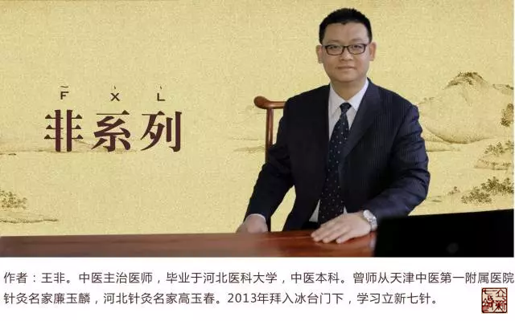
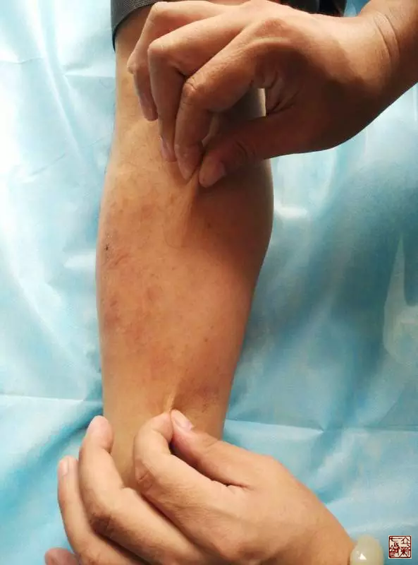
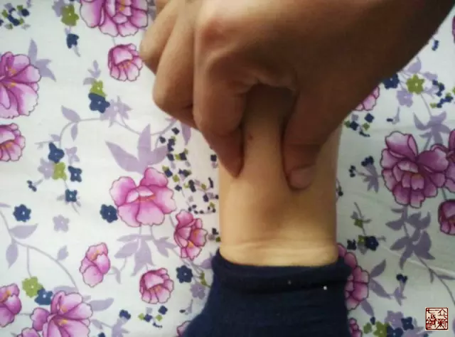

= 审切循扪按
王非
2015-11-11 00:00

“道法自然”是立新七针的思想精髓，推而演之就是“法无定法、穴无定穴”。《黄帝内经》
中就很少给出某一个穴的特别具体的定位。

那么临症时又如何取穴定位呢？我们再看《黄帝内经》：

* 《灵枢·刺节真邪第七十五》：“用针者，必先察其经络之虚实，切而循之，按而弹之，
视其应动者，乃后取之而下之”。
* 《灵枢·经水第十二》：“审切循扪按，视其寒温盛衰而调之，是谓因适而为之真也”。

“审切循扪按”，就是答案。“外有源泉而内有所禀”，“有诸内必形于外”，按图索骥远
远不如实体考察来得更接近真相，请大家注意这里是有其先后次第关系的。

== 审

首先是审，就是看，分为一看整体，二看局部。

=== 看整体

形气:: 《灵枢·阴阳二十五人第六十四》：“审察其形气有余不足而调之，可以知逆顺矣”。
即要求医家仔细观察病人的形体气色情况，又要判断其“有余不足”而进行针刺。

本末寒温:: 《灵枢·官能第七十三》：“审于本末，察其寒热，得邪所在，万刺不殆”、
“审皮肤之寒温滑涩，知其所苦”；《灵枢·禁服第四十八》：“必审察其本末之寒温，以
验其脏腑之病”，就是观察经脉在体表的寒热情况，并与症状相互参照判断邪气所在，再进
行针刺。

=== 看局部

“肤白勿取”《灵枢·官针第七》

看白点、黑点、不毛之地、晕斑等等，这里也是要先审的原因，因为这些晕斑、异常点往往
是在没有触碰的情况下最容易被发现，而不被人为的干扰。

=== 总结

综合以上可知，“审”主要的目的就是要根据病人的形体气色、疾病的症状和经脉在体表的
寒热情况，以及一些异于平常的反应点判断经脉虚实。确定病变的经脉、部位，为以下进一
步确定针灸治疗点缩小范围，奠定基础。

《素问·三部九候论第二十》：“必审问其所始病，与今之所方病，而后各切循其脉，视其
经络浮沉，以上下逆从循之”。就是要详细询问病人刚开始得病时的情况与现在的症状，再
在某条经脉上进行切循，判断“经脉沉浮”，即经脉的虚实情况。

== 切

本义：用刀把物品分成若干部分。临症时常常是要用指端以较小的接触面积较大的压强，较
为用力的下探，寻找较深部位的结节、横络、条索等。“切”常与“循”“按”一同出现。
《素问·骨空论第六十》：“缺盆骨上切之坚痛如筋者，灸之”。

== 循

一个“循”字再次展现出师父的上下游理论的精髓，不管是气路（卫气）的问题，还是血路
（十二正经）的问题，师父提炼出的上下游理论几乎是放之四海而皆准的真理，处处显示出
其光辉。

循：给我们提供的是实体考察的方向、线索，是指引。

再看《黄帝内经》：

* 《素问·痹论第四十三》 “循脉之分，各有所发，各随其过，则病瘳也”。也常与“切”
一起出现，表示来回抚摩，并结合用指按压。
* 《灵枢·周痹第二十七》：“故刺痹者，必先切循其下之六经，视其虚实，及大络之血结
而不通，及虚而脉陷空者而调之，熨而通之，其瘛坚，转引而行之”。

* 《灵枢·阴阳二十五人第六十四》：“按其寸口人迎，以调阴阳，切循其经络之凝涩，结
而不通者，此于身皆为痛痹，甚则不行，故凝涩。凝涩者，致气以温之，血和乃止”。此即
于经脉循行部位上下按压抚摸，察其虚实，注意有无血结不通之处，分别采用针刺调气或刺
络放血的方法通调经气，对于经脉上虚陷的地方按照“陷下则灸之”的原则采用热熨或艾灸
进行治疗。

== 扪

[quote,《说文》]
扪，抚持也。

[quote,《说文》]
持：握也。

所以“扪”的意思就是用手握或摸，不同于“切”的单纯向下用力，“扪”其实很像推拿手
法中的“拿法”，是相对用力的。这个手法特别适合检查皮下肉上的这一层分间，主要是查
看分间气是否通畅，像小腿内侧、背部督脉及膀胱经。这里借用穆超师兄的几张图片：

== 按

* 《灵枢·五邪第二十》：“取之膺中外腧，背三节五脏之傍，以手疾按之，快然，乃刺之”。
* 《灵枢·癫狂第二十二》：“厥逆腹胀满，肠鸣，胸满不得息，取之下胸二胁咳而动手者，
与背腧以手按之立快者是也”。
* 《灵枢·背腧第五十一》：“则欲得而验之，按其处，应在中而痛解，乃其腧也”。

这三条所述都是将按压之后疼痛缓解或病人自觉轻快为标准来寻找针刺点。

* 《素问·缪刺论第六十三》：
+
“邪客于臂掌之间，不可得屈，刺其踝后，先以指按之痛，乃刺之，以月死生为数”。
+
“邪客于足太阳之络，令人拘挛背急，引胁而痛，刺之从项始数脊椎侠脊，疾按之应手如痛，
刺之傍三痏，立已”。

《素问·缪刺论第六十三》中描述的则是以压痛点为针刺治疗点。

“按”之精要我们看《厘正按摩要术》：“按字从手从安，以手探其穴而安其上也”，其重
点在于“安”字。表达的是一种心理状态，是指我们在“按”的时候要安心、有耐心、专心、
细心，才能够准确的找到治疗点。

《黄帝内经》代表了中医学在理论和实践上的最高水平，与后世重视穴位和手法操作不同，
它极为强调经络实体诊察的重要性，甚至可以说，经络实体诊察是《黄帝内经》针刺诊断的
核心技术，也是我们立新七针道法自然的核心诊断技术。
