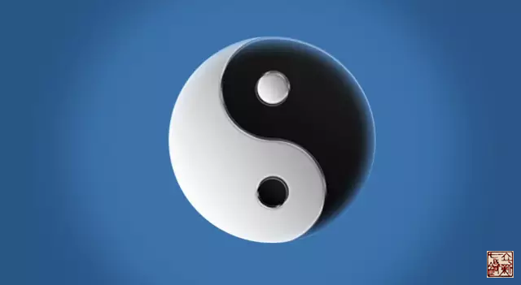

= 再说督脉
王非
2015-12-23 00:00

image::img/王非.png[]

《灵枢·营气第十六》原文：

* 黄帝曰：营气之道，内谷为宝。谷入于胃，乃传之肺，流溢于中，布散于外，精专者，行
于经隧，常营无已，终而复始，是谓天地之纪。
* 故气从太阴出，注阳明…上行至肝，从肝上注肺，上循喉咙，入颃颡之窍，究于畜门。
* 其支别者，上额循颠下项中，循脊入骶，是督脉也。络阴器，上过毛中，入脐中，上循腹
里，入缺盆，下注肺中，复出太阴。

《素问·骨空论第六十》原文：

* 黄帝问于岐伯曰：余闻风者百病之始也，以针治之奈何？
* 岐伯曰：…督脉者，起少腹以下骨中央，女子入系庭孔，其孔，溺孔之端，其络循阴器合
篡间，绕篡后，别绕臀，至少阴与巨阳中络者，合少阴上股内后廉，贯脊属肾，与太阳起于
目内眦，上额交颠上，入络脑，还出别下项，循肩髆内，侠脊抵腰中，入循膂络肾;其男子
循茎下至篡，与女子等;
* 其少腹直上者，贯脐中央，上贯心入喉，上颐环唇，上系两目之下中央。
* 此生病，从少腹上冲心而痛，不得前后，为冲疝。
* 其女子不孕，癃痔遗溺嗌干，督脉生病治督脉…

从原文可以看出督脉的走行是比较混乱，甚至是前后矛盾的。

我们该如何看待？先思考归纳如下：

== 起点

. 督脉起少腹以下骨中央（鱼头）
. 与太阳起于目内眦（鱼尾）

== 别行

. 支别者，上额循颠下项中，循脊入骶，是督脉也（鱼背）
. 少腹直上者，贯齐中央，上贯心入喉，上颐环唇上系两目之下中央（鱼腹）

请大家看看我们熟悉的太极图，我把督脉看做阳鱼，一从上起，一从下起，一循行于人体背
侧，一循行于人体腹侧，看似矛盾实则一也。阳鱼上小、下大亦有两端，鱼背、鱼腹分行两
条线。从图中我们看到鱼头即为人体少腹处，为阳气汇聚之处，就是大家常说的下丹田或是
命门所在之处，当为督脉真正的起始之处。上端鱼尾阳气由小变大之处，与足太阳膀胱经同
起于目内眦，其阳气占据势能优势，居高临下如瀑布飞流直下。我们再看鱼背走行在人体的
阳面——背部，是人体最宽阔平坦的部位，走行这人体气血最为旺盛的两条高速公路，督脉与
膀胱经，当气血在其中高速相向穿行时会发生什么？（下文详解）。

鱼腹则走行于人体的阴面，腹侧即为体内循行，贯脐、贯心、入喉、上颐环唇，上系两目之
下中央。我理解为在任脉的深面，与任脉走行并不矛盾。

*我们通过督脉腧穴与膀胱经背腧穴的横向联系看看有什么发现：*
　
【陶道】-------【大杼】：第一胸椎棘突下。::

释：陶道：制作陶器的转盘。杼：织布机上的筘，古代亦指梭。颈椎的旋转与胸椎的固定结
合处，就像制陶的转轮，大杼就像梳子式的工具可以给转盘提供动力。

【身柱】------【肺俞】：第三胸椎棘突下。::

释：身柱：身体的支柱，肺主气，给身体的支柱打气，帮助支撑身体，同时身柱也支撑起肺
吸纳清气。肺藏魄。

【神道】------【心俞】：第五胸椎棘突下。::

释：心主神明，神出入的道路。

【灵台】------【督俞】：第六胸椎棘突下。::

释：灵台：观天象的台子。《說文》督：察也。就是说站在观察天象的台子上观察天象。这
个部位是个高台可以观察天部的情况。

【至阳】-------【膈俞】：第七胸椎棘突下。::

释：至阳：当人体俯卧时，这里是人体最高的地方，也是膈肌所在，阳气行至此当为一个关
口，多有阻碍。

【筋缩】-------【肝俞】：第九胸椎棘突下。::

释：筋缩就是筋的伸缩范围减小，当我们触摸时会感觉紧张、僵硬、痉挛、肿胀、囊样变，
并有明显压痛。患者会有关节活动范围减小，转头受限，弯腰困难，抬腿弯膝困难。筋一词
早在《内经》中已出现。《素问·痿论第四十四》曰：“宗筋主束骨而利机关也”，《素问·五
藏生成第十》：“诸筋者,皆属于节”。《說文》日：“筋,肉之力也。从肉从力从竹。竹，
物之多筋者。”从力,指出了筋可以产生力量;从月肉旁者,明确了筋是肉性组织。《内经》
认为筋与脉、肉、皮、骨共为五体，为肝脏所主，气血所养，所以肝俞在其旁濡养之。

【中枢】------【胆俞】：第十胸椎棘突下。::

释：中枢：中央枢纽。少阳胆经循行于人体的侧面，为阴阳交会的枢纽；子时胆经当令，子
时亦是阴阳交会的时刻。

【脊中】------【脾俞】：第十一胸椎棘突下。::

释：中央戊己土，脾土位属中央，脊柱亦为人体的中央，同属脾土。脾土又为后天之本，气
血生化的源头，可以濡养宗筋，亦是治疗筋缩的主要方面。

【悬枢】-------【三焦俞】：第一腰椎棘突下。::

释：悬为托空不着之处，枢为致动之机。本穴治腰强直不得屈伸等症，故名之以枢。人当仰
卧之时，腰脊处约有数寸悬空，可以探手通过。本穴适当此处之上端，两条竖脊肌之间，故
名之悬，另此处为胸椎与腰椎结合处，也是相对的静与动的结合处，枢纽处。而曰“悬枢”。
小儿仰卧，悬空最显，老弱疲乏者悬空较微。厥阴三焦，亦属阴阳转换至枢纽。

【命门】-------【肾俞】：第二腰椎棘突下。::

释：命，人之根本也，以便也。门，出入的门户也。肾主藏精，精为阳的浓缩状态。例如生
活中的味精、酒精等，都是容易气化的，反过来也可以认为是气的凝缩状态。好比：命门为
炉灶。肾俞为液化气罐。命门火又会加热肾精肾水，促进由精转气。

【腰阳关】--------【大肠俞】：第四腰椎棘突下。::

释：腰阳关：元阴元阳相交处，寒冷关通行之所。大肠俞意指大肠腑中的水湿之气由此外输
膀胱经。
