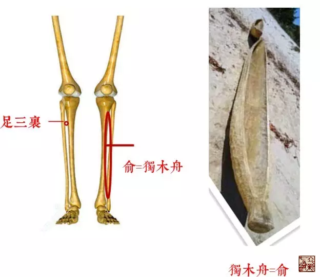

= 骨空论之膝痛部分
王非
2016-1-13 00:00

image::img/王非.png[]

== 【原文】

[quote]
____
蹇，膝伸不屈，治其楗。坐而膝痛，治其机。立而暑解，治其骸关。膝痛，痛及拇指，治其
腘。坐而膝痛如物隐者，治其关。膝痛不可屈伸，治其背内。连䯒若折，治阳明中俞髎，若
别，治巨阳少阴荥。淫泺胫酸，不能久立，治少阳之维，在外上五寸。

辅骨上横骨下为楗，侠髋为机，膝解为骸关，侠膝之骨为连骸，骸下为辅，辅上为腘。腘上
为关，头横骨为枕。
____

== 【之我见】

. 行走困难的，膝关节强直、不能屈的（股四头肌的原因导致屈膝不能），治疗在大腿前侧。
（胃经、脾经：气冲、血海、梁丘）
. 坐位疼痛，治疗在髋关节。（臀部肌肉问题，取穴传统环跳）
. 站立位时，膝关节内热而且有裂开的感觉，治疗在股骨与胫骨之间。（膝内问题：治疗主要
在关节间隙，髌韧带、内外侧副韧带等。）
. 膝痛连及足拇指，治疗在腘窝。
. 坐位膝痛有如里面有物支撑隐隐而痛，治疗在腘窝的上面（此症状应为坐骨神经卡压所引
起的，梨状肌为关，坐骨神经出口。现代的环跳穴。）
. 膝痛不可以屈伸的，治疗其后背的夹脊穴、背腧穴。
. 膝痛连及胫骨，好像折了一样，治疗阳明胃经的一个穴，中俞髎—像舟一样的骨头的空隙
中。（足三里、上下巨虚）。
+

. 如果用其他的方法，就用足太阳和少阴的荥穴。足通谷穴、然骨穴。
. 腿酸软不能久立，治疗在少阳胆经的络穴，光明。

//

* 蹇：跛也，难也。行难谓之蹇。
* 楗：竖插在门闩上使闩拨不开的木棍。
* 暑：热也。
* 解：《说文》判也。从刀判牛角。判，分也。
* 骸：胫骨也。
* 机：其斜上侠髋者，则所谓机也。关节能活动为机。
* 关 ：以木橫持门户也。
* 骸关：髀胫之间。
* 俞：空中木为舟也。
* 髎：《玉篇》髖也。《方书》章门下八寸监骨上陷中，为居髎。缺盆中上毖骨际陷中央，
为天髎。《类篇》一曰马胯上骨为八髎。
* 淫：水从缝隙浸入。
