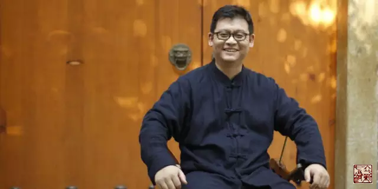

= 停刊启事
王非
2016-1-14 00:00

编辑组：

2014年冬月立新七针第二届年会上，听得王非与百六十余人分享“在筋守筋”为主题的发言。
同排就坐的一些老牌中医、名医啧啧赞叹，“这个好，这个真好。ppt能拷贝一份吗。”因
为这个发言，促成了《非系列》的诞生。栏目名称“非系列”来自作者名，同样寄予栏目
“非常平常”之意。2015年1月26日首发非系列正经说，截止昨日满廿期。新年伊始，作者
王非一面经营诊所、一面担当重庆立新七针针灸协会秘书长，同时备课立新七针疗法2016年
春季初级班课件。歇个脚，喝杯茶，来日方长，他日再续。

感谢本栏目责任编辑榛子。感谢先后担当此栏目校对工作的梓诚、泠泠、扬戈以及负责终审
的丰亚。今日特刊发作者王非停刊启事。祝福读者冬安！

《非系列》走过一年时间。非常感谢有你的陪伴。写“非系列”的初衷是看到信奉《黄帝内
经》、信奉立新七针的人有很多，但大家的知识背景不同，人生阅历不同，各自的领悟与实
践不同，有些同仁与我走过的路一样，在“信解行证”的过程中出现过许多彷徨与迷茫，所
以我就想从最基础的部分开始，和大家一同复习经典，领悟七针，破迷开路。这一路走来得
到了大家许多的支持鼓励，也是我坚持下来的动力。

说到“信解行证”，记得一次与友人的谈话中我提出了一个问题“信、解、行、证”哪一个
环节是最重要的？在这里也想与大家讨论一下。因为这是学习立新七针的最重要的法门。

*我认为“信”是最关键，最重要的。信是信奉、信念、信心、相信。*

信奉《黄帝内经》、信奉道法自然、信奉立新七针，只有此信念坚定的人才能做到充分的理
解立新七针，才能谨记师父对我们的每一次教诲，真正领会师父每一句话的深刻含义，在实
践七针的路上百折不挠，不畏艰辛，一门精专，勇猛向前，才能证到七针的一点精髓，才能
有力量不断的“信、解、行、证”的走下去。

“万物皆由心生”，心念一动八方呼应，师父也曾告诉我们：气血的奥秘全在一念，人的气
血运行分布其实也是人自己的心神所控制的。这里引用爱因斯坦的老师、量子理论之父——马
克斯·普朗克博士（1918年获得诺贝尔物理学奖）的话：“我对原子的研究最后的结论是——
世界上根本没有物质这个东西，物质是由快速振动的量子组成！”他进而剖析说：“所有物
质都是来源于一股令原子运动和维持紧密一体的力量，我们必须认定这个力量的背后是意识
和心智，心识是一切物质的基础。”《黄帝内经》中的气血也是物质的，也是符合上述这一
规律的。心识是气血的基础，心识也是七针的基础，这话说回来还是一个“信”字。

作为一个七针医者，当我们面对患者时，如果对自己没有信心，对七针抱有怀疑，那么患者
也一定会感觉到的，这样即便我们辨证选穴对，手法操练熟，也不会取得好的效果，因为患
者的心神没有被调动，气血自然也不会顺畅。从我的角度观察，不论是高手云集的年会交流，
还是甘肃酒泉的七针之旅，看到那些做得好的师兄都是信念无比坚定，信心满满，治疗时气
定神闲，患者心悦诚服，积极配合，如此气场，疗效自不必说。这真是怎一个“信”字了得！

有了“信”做基础，“解”就简单了，有师父不离不弃，诲人不倦，有微信平台、协会群师
兄弟们相互帮助交流，还怕“解”不了吗？剩下的就是要大胆实践，勤于实践，走出自己的
路。最终定会证得果位，走上七针的金光大道。

在新的一年里我希望与大家一起，在“信解行证”的七针之路上不断一同前行。提前给大家
拜年，祝福大家安康、喜乐。

接下来的一段时间里我们暂停“非系列”，养精蓄锐，信解行证，烹出美味，以飨读者。
