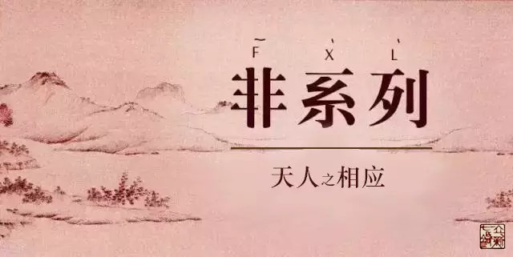
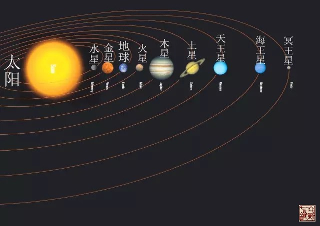

= 天人相应的正确打开方式（一）
王非
2017-02-22

编者按：我们后台收到一些用户留言，希望看到不那么晦涩深奥的解读，我们重庆巴南立新
七针针灸研究所的培训讲师王非，以浅显易懂的语言来解解天人相应之奥义，作为专栏《非
系列》丁酉年之开篇。

中医思维模式的第一要点就是“天人相应”，也就是说中医认知生命本源、疾病的产生原因、
治疗思想的形成等这些都是从“天人相应”的角度展开思考的。那么天与人如何相应？

“天”就是指我们人类生存所处的环境，环境随着人的移动而变化，环境也随着春夏秋冬时
间的变化而变化。所以这里就有两个维度，一个是空间维度；一个是时间维度。

先从空间这个维度看，如果我们站到太阳系的角度看，所有的生物都生活在地球上。那为什
么只有地球才有生物呢？地球的什么特点产生了生物呢？

最重要的就是阳光，万物生长靠太阳。在九大行星中，地球距离太阳既不太远，也不太近。
太远了，比如冥王星，接受到的太阳光芒极少，仿佛传说中的阴曹地府，生命由于得不到足
够的能量而无法生存；太近了，比如金星，接受到的太阳光芒极多，白天黑夜的温度都在
400摄氏度以上，就像神话中的炼狱，生命也难以生存。

太阳与地球的距离特别合适，不远也不近，地球就有了合适的阳光，植物就可以自如地进行
光合作用，储存生命能量，素食动物吃植物，肉食动物吃素食动物·····就这样，是太阳的
光能开动了地球上动物和植物的生命机器，使动植物子孙兴旺、生生不息。

应用“天人相应”的思想看，人体里的太阳是谁呢？

要想回答这个问题就要看太阳它的特点有哪些：

. 是东升西落、昼夜更替、循环往复；
. 看过日出的人就会明白，太阳一跳出地平线，马上光芒万丈，普照大地，瞬间到达每一个
角落；
. 随着阳光而来的就是温暖，阳光照到哪里哪里暖。

我们再看看卫气与阳光：

. 气的循行是与太阳运行保持一致的，日出则出，日落则入，昼夜更替。
+
内经原文：“故卫气之行，一日一夜五十周于身，昼日行于阳二十五周，夜行于阴二十五周，
周于五脏。是故平旦阴尽，阳气出于目，目张则气上行于头······”。
. 气的布散与阳光的照射是一样的，瞬间到达所有地方，特别是最远最末梢的地方。
+
内经原文：“卫气者，出其悍气之慓疾，而先行于四末分肉皮肤之间而不休者也。昼日行于
阳，夜行于阴······”。
. 气的作用与阳光一样带来温暖，卫气布散到的地方就会温暖，反之寒凉的地方就是卫气布
散不利的地方。
+
内经原文：“卫气者，所以温分肉，充皮肤，肥腠理，司关阖者也。”

结论：卫气就是人体里的太阳光。

我们普通人一般日常的活动范围都不大，局限在一市一村一街道，随着视角不断上升到地球、
太阳系及整个宇宙，此空间维度出现了；另一个维度就是时间维度，这里主要就是说春、夏、
秋、冬。我们“人”呢，就是这两个环境共同作用下的产物。也就是说“天”是什么样的，
“人”就被塑造成了什么样子。

天之与人应已述，地又如何与人相应？下周二《非系列》继续等您。

此为《非系列》专栏作者王非的原创文章，若需转载请联系我们编辑部。
