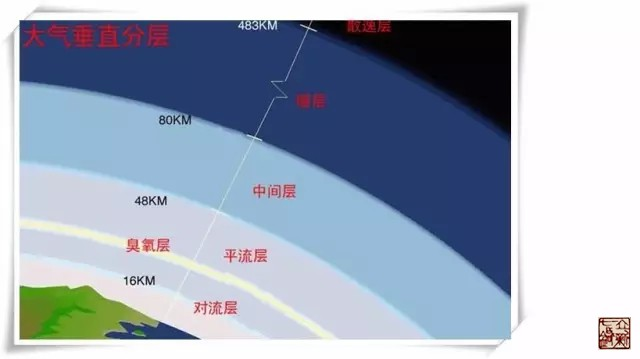
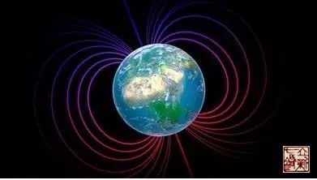
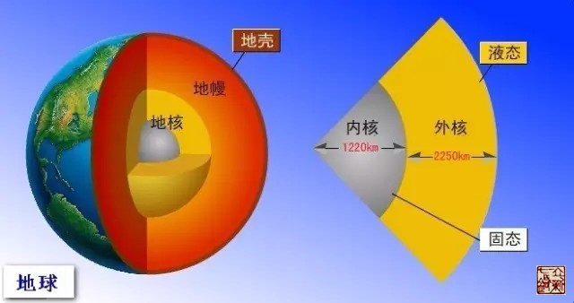
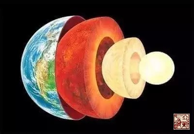
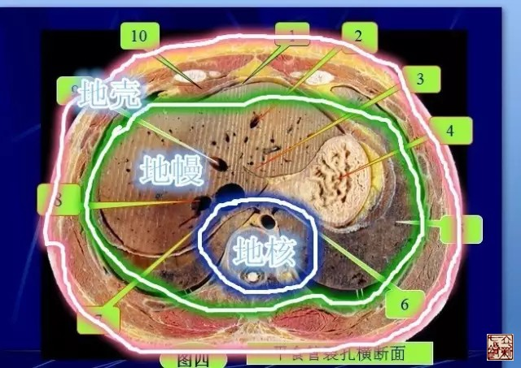
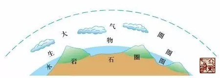

= 天人相应的正确打开方式（二）
王非
2017-02-28

== 天部

=== 地球表面有两个重要的保护层

==== 大气层

它遮挡住了来自宇宙空间的强烈的紫外线，使地球上的生命免遭伤害，大气层挡住了大部分
撞向地球的陨石，大气层就像一床厚厚的棉被，使照射到地球表面的太阳光不会发散到太空
中去，地球的温度才不会剧烈变化；假如没有大气层的保护，地球上就不会刮风下雨，也不
会有江河湖海，地球将是一个死寂的荒凉星球。

==== 磁场

地球上有繁荣的生命，这与他是一颗岩石星球也不能截然分开，地球的核心是融融的岩浆，
岩浆的主要成分是铁。在地球自转过程中，铁质核心产生了强烈的磁场。这种磁场包绕着地
球，保护着地球。当太阳风暴，也就是来自太阳的高速带电粒子流，向地球猛烈袭击时，这
种包绕着地球的磁场把它挡在了太空，从而保护了地球上的生命。

=== 人体的天部：皮肤

人体的第一道防线：皮肤同大气层及磁场一样，是人体的第一道防线，皮肤一方面保护机体
内各种器官和组织免受外界环境中紫外线、磕磕碰碰、细菌微生物等这些机械的、物理的、
化学的和生物的等有害因素的损伤，另一方面防止组织内的各种营养物质、电解质和水分的
丧失。

恒定温度：同大气层棉被效应一样，皮肤维持人体体温恒定在36℃～37℃之间，但同时机体
内物质代谢过程中产生热量，皮肤又是体内热量散发的重要组成部位，可以通过皮肤血管收
缩、立毛、排汗减少等形式来调节体温，也可以通过辐射、对流、传导、蒸发等物理方式来
散发热量。

产生云雨：运动过后我们汗如雨下，天热时我们汗出如油，这是皮肤的分泌和排泄作用，主
要是通过汗腺分泌汗液，皮脂腺排泄皮脂进行的。排汗具有散热降温、保护皮肤、排泄药物、
代替肾脏部分功能等作用；皮脂具有形成皮表脂质膜、润泽毛发及皮肤的作用。

有诸内必先现于外：每当乌云密布，我们就知道暴雨将至。还有“早霞不出门，晚霞行万
里”是说所以出现朝霞时，预示西边的水汽，不久会移动到本地，形成降水等。出现晚霞时
则表明水汽已经移出本地，预示晴好天气。我们人体的异常情况也可在皮肤上反映出来，即
所谓的“肤白勿取”。

== 地部

=== 地球的结构

(1910年，前南斯拉夫地震学家莫霍洛维奇意外地发现，地震波在传到地下50公里处有折射
现象发生。他认为，这个发生折射的地带，就是地壳和地壳下面不同物质的分界面。1914年，
德国地震学家古登堡发现，在地下2900公里深处，存在着另一个不同物质的分界面。后来，
人们为了纪念他们，就将两个面分别命名为“莫霍面”和“古登堡面”并根据这两个面把地
球分为地壳、地幔和地核三个圈层。)

==== 地壳

地壳上层为花岗岩层（岩浆岩），主要由硅－铝氧化物构成；下层为玄武岩层（岩浆岩），
主要由硅－镁氧化物构成。

理论上认为过地壳内的温度和压力随深度增加，每深入100米温度升高1℃。近年的钻探结果
表明，在深达3公里以上时，每深入100米温度升高2.5℃，到11公里深处温度已达200℃。

==== 地幔

地壳下面是地球的中间层，叫做“地幔”，厚度约2865公里，主要由致密的造岩物质构成，
这是地球内部体积最大、质量最大的一层。地幔又可分成上地幔和下地幔两层。一般认为上
地幔顶部存在一个软流层，推测是由于放射元素大量集中，蜕变放热，将岩石熔融后造成的，
可能是岩浆的发源地。软流层以上的地幔部分和地壳共同组成了岩石圈。下地幔温度、压力
和密度均增大，物质呈可塑性固态。

地幔上层物质具有固态特征，主要由铁、镁的硅酸盐类矿物组成，由上而下，铁、镁的含量
逐渐增加。

==== 地核

地幔下面是地核，地核的平均厚度约3400公里。地核还可分为外地核、过渡层和内地核三层，
外地核厚度约2080公里，物质大致成液态，可流动；过渡层的厚度约140公里；内地核是一
个半径为1250公里的球心，物质大概是固态的，主要由铁、镍等金属元素构成。地核的温度
和压力都很高，估计温度在5000℃以上，压力达1.32亿千帕以上，密度为每立方厘米13克。

=== 人体的结构

==== 人体的地壳

人体的皮下脂肪、肌肉、筋膜这些构成了人体的地壳部分，就像花岗岩、玄武岩一样，它们都是比较硬的。

==== 人体的地幔

人体的内脏部分就像是地幔部分，所占躯体的体积最大，也是固体形态，而且由表及里温度
在升高。

(人体的正常体温相对稳定在37℃左右。然而，由于体内各脏器所在的位置不同，温度也各
不相同。从内脏到体表各部位参差不齐的体温，对维持人体的生理活动及新陈代谢至关重要，
与人们的身体健康休戚相关。经医学测定，素有人体“火炉”之称的肝脏，温度可达38℃左
右；大脑的温度接近于肝脏、肾脏和十二指肠的温度，在37.6℃上下；直肠和血液的温度稍
低，通常是37.5℃；口腔、咽喉的温度约为37.2℃；睾丸是人体的“冷库”，正常温度在
35℃～35.5℃。体表各部位温度差异更大，当室内温度在27℃时，躯干部位体表温度为32℃，
头皮温度为33℃，腋窝皮肤温度为37℃，手心为30℃，脚掌心为27℃。)

==== 人体的地核

脊柱、腹主动静脉、脊髓组成了人体的地核，脊柱特别是椎体部分就是内核，是固体部分，
腹主动静脉是包裹内核流动的外核，脊髓部分也是有脑脊液的循环，也是外核的构成部分。

== 人部

=== 生物圈

生物圈是指地球上所有生态系统的统合整体，是地球的一个外层圈，其范围大约为海平面上
下垂直约10公里。从地质学的广义角度上来看，生物圈是结合所有生物以及它们之间的关系
的全球性的生态系统，包括生物与岩石圈、水圈和空气的相互作用。生物圈是一个封闭且能
自我调控的系统。地球是整个宇宙中唯一已知的有生物生存的地方。一般认为生物圈是从35
亿年前生命起源后演化而来。

生物圈是一个复杂的、全球性的开放系统，是一个生命物质与非生命物质的自我调节系统。
它的形成是生物界与水圈、大气圈及岩石圈（土圈）长期相互作用的结果，生物圈存在的基
本条件是：

. 必须获得来自太阳的充足光能。因一切生命活动都需要能量，而其基本来源是太阳能，绿
色植物吸收太阳能合成有机物而进入生物循环。
. 要存在可被生物利用的大量液态水。几乎所有的生物全都含有大量水分，没有水就没有生
命。
. 生物圈内要有适宜生命活动的温度条件，在此温度变化范围内的物质存在气态、液态和固
态三种变化。
. 提供生命物质所需的各种营养元素，包括O₂、CO₂、N、C、K、Ca、Fe、S(氧气 、二氧化
碳、氮、碳元素、钾元素、钙元素、铁元素、硫元素)等，它们是生命物质的组成或中介。

总之，地球上有生命存在的地方均属生物圈。生物圈的要领是由奥地利地质学家休斯
（E.Suess）在1875年首次提出的，是指地球上有生命活动的领域及其居住环境的整体。生
物的生命活动促进了能量流动和物质循环，并引起生物的生命活动发生变化。生物要从环境
中取得必需的能量和物质，就得适应环境，环境发生了变化，又反过来推动生物的适应性，
这种反作用促进了整个生物界持续不断的变化。

=== 卫气圈、经络圈

三者，人也。人之所以成生者，血脉也。

此为《非系列》专栏作者王非的原创文章，若需转载请联系我们编辑部。
