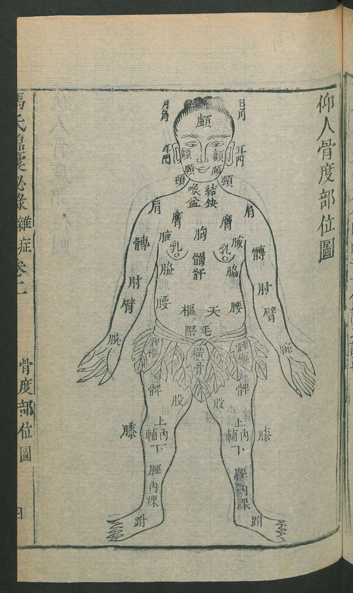
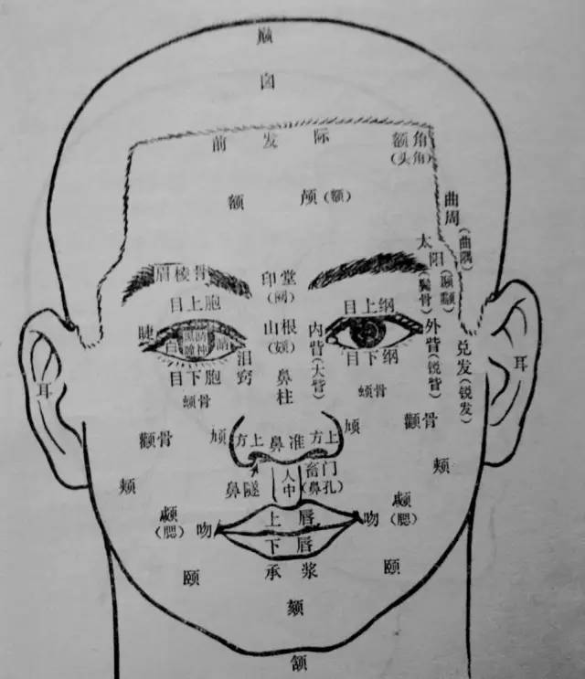

= 人體部位名稱

[cols="^.^1s,3,^.^1s,3"]
|===

4+| 頭頸項部

| 巔 | 頂巔也。指頭頂正中高點，當百會穴處。
| 額顱 lú | 顖前為髮際，髮際前為額顱。前額骨部，在發下眉上處。
| 顔 | 額上曰顔。說文曰眉目之間也。
| 目銳眥 zì | 眥，目厓也。《靈樞 ‧癲狂》：「目眥外決于面者為銳眥。」指目外角。大角為內眥。
| 䪼 zhuō | 颧骨。眼眶的下方，包括顴骨內連及上牙床的部位。
| 頞 è | 鼻莖，指鼻根，又稱山根。
| 顴 quán | 位于眼的外下方,在颜面部隆起的部分。
| 頄 qiú | 權也。《玉篇》面顴也。《廣韻》頰閒之骨。顴頰間骨。
| 頏 háng 顙 sǎng | 亢,人颈也。颡,额也。咽顙
| 顋 sāi | 同腮。
| 頰 jiá | 耳下曲處為頰。面旁的總稱。面旁也。面者、顏前也。顏前者、眉閒目閒巳下至頰閒也。其旁曰頰。
| 頤 yí | 口角後，下頜部。
| 頜 hé | 頷頤頜也。南楚謂之頷。秦晉謂之頜。頤其通語也。
| 颏 | 
| 頷 hàn | 顋下也
| 頸 jǐng | 脖子的前面部分。廣韻》頸在前，項在後。
| 項 | 项,头后也。
| 咽 | 嗌也。咽者、因也。言食因於是以上下也。所以通飲食居喉之後。
| 喉 | 所以通呼吸居咽之前。位于舌根与气管之间
| 柱骨之會上 | 張介賓註：「頸項之根為天柱骨」，意指頸椎。「會上」指大椎，為六陽
經所聚會，釋作鎖骨。

4+| 肩部

| 髃 yú | 肩前骨；肩头；肩峰部。
| 肩解肩胛 | 滑伯仁註：「脊兩旁為膂，膂上兩角為肩解，肩解下成片骨為肩胛。」張介
賓註：「肩後骨縫曰肩解。」按：「肩後骨縫」指肩關節縫；兩角指左右肩峰與肩胛岡部；
成片骨即指肩胛骨體。
| 肩髆 bó | 肩甲也。
| 胛 jiǎ | 與胷脅相會闔。

4+| 胸腹部

| 胃口 | 《銅人》註：「胃口，謂胃之上口，賚門之位也。」 
| 胃口 | 指胃之下口，即幽門部。 
| 膈 gé | 膈膜也。膈上為宗氣之所聚是為膻中。人或哺乳动物体腔中分隔胸腹两腔的膜状肌肉。亦称“膈膜”、“横膈膜”。
| 膺 yīng | 膺,胸也。胸前為膺,一曰胸兩旁高處為膺。
| 胸中 | 兩乳之間也
| |

4+| 腰背部

| 膂 lǚ | 挾脊兩旁的肌肉。？
| 腋 yè | 脇之上際。胳肢窝，上肢同肩膀相连处靠里凹入的部分
| 脅 xié | 胁,两膀也。
| 胠 qū | 腋之下脇之上也
| 季脅 | 脇下小肋。人體最下面的肋骨，相當于側胸第十一、第十二肋軟骨部位。
| 䏚 miǎo | 䏚在季脅下，俠脅兩旁虛耎處，腎外當䏚
| 髀 bì | 股外為髀。股也一曰股骨
| 髀樞 | 捷骨之下髀之上曰髀樞當環跳穴。在人體盤骨的下方，與下肢股骨相接之處，凹陷如臼，股骨即嵌入其中。
| 髀厭 | 捷骨之下為髀厭即髀樞中也。即髀樞。
| 髀關 | 伏兔上交紋處曰髀關。穴在髂前上棘直下，縫匠肌外側，約平會陰。
| 臀 tún | 臀,尻也。
| 尻 kāo | 尾骶骨也亦名窮骨。尻今俗云溝子是也。今俗云屁股是也。尻骨謂之八髎。

4+| 手臂部

| 臑 nào | 上臂。屈側稱臑內，當肱二頭肌部；伸側稱臑外，當肱三頭肌部。 
| 臂內 | 臂，指前臂；內，指內側，即掌側。
| 上骨 | 「臂之上骨」指橈骨。
| 上廉 | 取曲肘執筆體位，上廉即靠橈骨一側。
| 大指次指 | 大指側的次指，即食指，又名示指，亦即第2指。
| |

4+| 足股部

| 股 | 膝上曰股
| 臏 bìn | 膝蓋骨
| 膕 guó | 骸下為輔，輔上為膕。膝後曲節中也。
| 輔骨 | 膝下内外側大骨也。
| 成骨 | 膝外廉之骨獨起者。
| 腨 shuàn | 腓腸也。小腿肚，即腓腸肌部。
| 脛 jìng | 膝以下骨也。
| 骭 gàn| 骭,胫也。
| 踝 huái | 人足左右骨隆然圜者也。在外者謂之外踝。在內謂之內踝。
| 跗 fū | 足上也。足背也。足面也。
| 踵 zhǒng | 足后曰跟,又谓之踵。足根也。
| 核骨 | 張介賓註：「大指本節後內側圓骨。」其形如半個果核，故名核骨。即指第1蹠骨
的頭部突起。
|===

